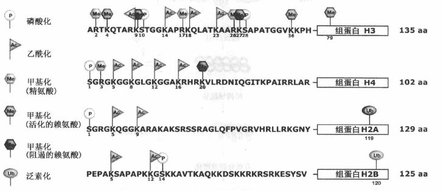
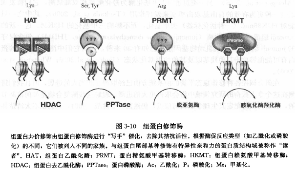

# Epigenetics

## 一、概述

1. 组蛋白修饰

    甲基化，乙酰化，磷酸化，泛素化，sumo化，ADP核糖基化，脯氨酸异构化
    常见活化标志：乙酰化，精氨酸甲基化，一些赖氨酸甲基化（H3K4,H3K36)
    抑制标签：H3K9，H3K27，H4K20甲基化
    
    

    组蛋白修饰的主要四种酶系统和逆向修饰酶系统：

    * __组蛋白乙酰化酶__（Histone acetylase,HAT）:催化赖氨酸残基乙酰化，可被 __组蛋白去乙酰化酶__(histone deacetylase, HDAC)所逆转。活化。

    * **组蛋白激酶家族**可令特定**丝氨酸（S），苏氨酸（T）**磷酸化，可被磷酸化酶逆转。

    * **甲基化酶**：**组蛋白精氨酸（R）甲基转移酶（histone arginine methyltransferase, PRMT）**，**组蛋白赖氨酸（K）甲基转移酶（histone lysine methyltransferase,HKMT）**,赖氨酸甲基化包含单，双，三甲基三种形式，H3，H4N端三甲基化残基可能具有稳定遗传功能。**精氨酸瓜氨酸化酶**可将甲基化的精氨酸转变为瓜氨酸残基。**去甲基化酶（lysine specific demethylase, LSDl）**可去除H3K4的甲基化修饰，但仅针对单甲基化或双甲基化。

    

2. DNA甲基化

    * 出现在酵母外所以有真核生物，一般为**胞嘧啶**甲基化。通常发生在CpG中，主要在非编码区和转座子区域，而非活化基因CpG岛。（参与宿主防御机制）
    * DNA甲基转移酶（DNA methyltransferase, DNMT）催化从头甲基化，或维持半甲基化的甲基化。
    * 单个胞嘧啶甲基化有自发性突变倾向，甲基化胞嘧啶可经脱氨基作用转变为胸腺嘧啶。
