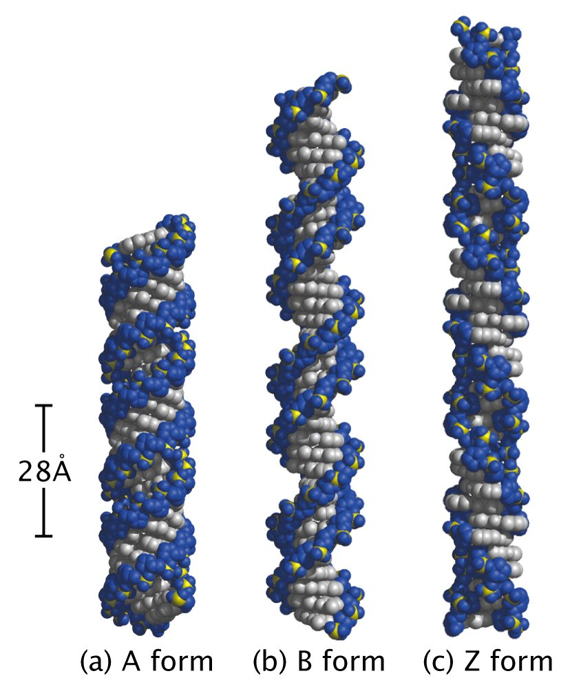
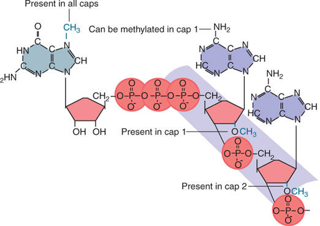
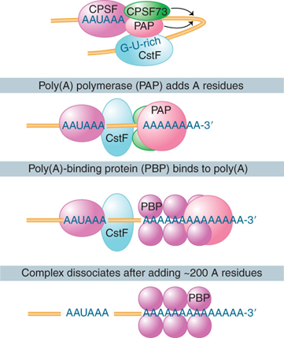
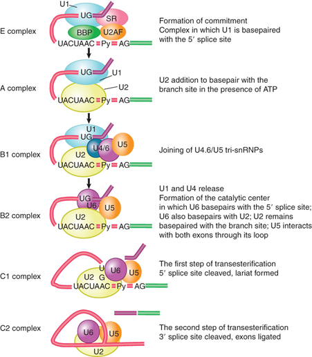

# Molecular Biology

## 1. Introduction of Mecular Biology

## 2. The molecular nature of genetic materia

1. 遗传物质
    RNA:

    * 少量病毒，单链/双链
    * 逆转录可令宿主癌变，致癌病毒

    蛋白：

    * prion（30-50nm），无免疫效应
    * PrPC-PrPSc（无法被溶酶体降解，破裂流出）
    * 争议

2. Structure of nucleic acid

    * nucleoside: purine/pyrimidine + pentose sugar 
    * nucleotide: nucleoside + phosphate group
    * 维持结构因素：氢键，碱基堆积力，磷酸基团经典排斥力，碱基分子内能
    * 碱基序列排列位置导致构象改变（A，B，Z型），盐多Z型，而正常生物体大多数为A，B混合

        

    * 超螺旋结构：I型**拓扑异构酶**催化单股DNA断裂在连接，不需能量辅因子；II型催化双股，需要ATP

3. Nucleic acids hybridize by base pairing 
    原位杂交技术
    Southern blotting:DNA; Northern:RNA; Western: protein

## 3. Genes, genome & genomics

1. Genes

    * 编码区（外显子内含子）；前导区；调节区（启动子增强子）
    * Every DNA 3 possible reading frames.
        * **Open reading frame(ORF)**:start with initiation codon(AUG) and end with termination codon(UAG,UAA,UGA)
    * 大小主要取决于内含子的有无、大小以及数量

2. Genes Encode RNAs and Polypeptides

    * Mutation:
        * transition(转换)，transversion(颠换)，Base mispairing，insertion
        * Revertants, Forward mutations, A back mutation. A true reversion
        * Second-site reversion, Suppression, A suppressor
        * A null mutation; Leaky mutation. A losss-of function mutation
        * Recessive mutations: loss-of-function
        * Dominant mutations: gain-of-function

    * cis configuration: DNA sites; trans configuration: protein or RNA
3. The interrupted gene
    * exon; intron(易突变);

4. Genome
    * C值: 生物体单倍体基因组DNA总量。
        C值悖论（C value paradox)：C值和生物结构或复杂性不一致的现象。

    1. 病毒基因组
        1. 可为DNA或RNA
        2. 大小差异较大
        3. RNA基因编码具节段性
        4. 存在基因重叠
            同一段DNA片段可编码两种或以上的DNA分子
        5. 大部分序列可编码
        6. 转录单元是多顺反子
    2. 原核生物基因组
        * 特征： 基因密度高，重复序列少
        * 质粒可自主复制，携带遗传信息

    3. 真核生物基因组：
        * 细胞核基因组和细胞质基因组
        * 特征：
            1. 大量重复序列
                * 单拷贝序列（低重复序列）40%-80%，大部分结构基因
                * 中度重复序列：重复此时10-105，10%-40%，rRNA，tRNA，组蛋白。与基因调控有关
                    > Alu家族，中度重复序列中散在重复序列，研究较多。每个成员300bp，Alu序列重复30-50万次
                * 高度重复序列：可重复百万次，10-60%,如反向重复序列，卫星DNA。
                * 重复序列多态性：
                    * 单核苷酸多态性（SNP），最常见
                    * 串联重复序列多态性
            2. 多基因家族与假基因
                * 多基因家族：某一祖先基因经重复和变异产生的一组基因
                    > 珠蛋白及原因家族，组蛋白基因家族
                * 假基因：与有功能基因结构相似，但不能表达有功能的基因产物的基因。
            3. 细胞器基因组（线粒体叶绿体）：主要编码呼吸链酶，rRNA和tRNA； 母系遗传，突变率高，与通用遗传密码存在差别

    4. Genome evolution

## 4. DNA Biosynthesis

    半不连续复制

    1. DNA pol I
        1. larger cleavage product: polymerase 3‘-5’ exonucleolytic activity
        2. small fragment: 5‘-3’ exonucleolytic activity
        not the major replicase
    2. DNA ppol III:main replicase
        * dimeric structure:A catalytic core (催化核心) ;A dimerization subunit (二聚化亚基);A processivity component/clamp and clamp-loading complex (进行性组分或滑动钳和钳载复合物)
        * caralytic core:
            $\alpha$ subunit: the DNA polymerase activity
            $\$

## 5. DNA damage repair and mutation

Damage: abnormal 

### 5.1 Factor of causing DNA damages

* Endogenous: 
    1. instability of DNA structure
    2. base mismatch
    3. attack of reactive oxygen

* Exogenous:
    1. Physical factors

### 5.2 Mechanisms of DNA repair

1. Direct reversal
    * 嘧啶二聚体：光复活酶修复
    * 烷基化：甲基转移酶将碱基上甲基转移
    * 断裂双联：连接酶修复

2. Excision repair（切除修复）
    * 碱基切除修复：糖苷酶（glycosylases)
    * 核苷切除修复：核酸内切酶（endonuclease）切除单链

3. Mismatch repair（错配修复）

4. Double-strand break repair(双联断裂修复)
    * Homologous recombination
    * Non-homologous end joining(NHEJ)
    * Microhomology-mediated end joining(MMEJ)

5. Damage bypass

### 5.3 Mutation Type

1. Small-scale mutations:
    1. point mutations
    2. insertions
    3. deletions
2. Large-scale mutations:
    1. Amplifications
    2. Deletions
    3. Teanslocations

## 6. RNA biosysthesis

### 6.1  General feature of transcription

1. Sepecific gene expression unit

    * RNA polumerase (DNA-dependent RNA polymerase)
    * Promoter(RNA polymerase binding point)
        > -35 ---- -10，startpoint:+1(no 0)
    * Startpoint
    * Terminator
    * distal（远端）, proximal（近端）
    * Transcription unit(between sites of initiaion and termination by RNA polymerase)
2. dNTP, Mg2+
3. separated Double strands
    * RNA polymerase can separated before trasncription and 
    * Transcription start in bubble(12-14bp)
4. Purine 1st (G)

### 6.2 Enzymology

1. Prokaryotic RNA polymerase
    * holoenzyme: $\alpha 2 \beta \beta' \omega \sigma$; $\sigma$ is various in different speciese while others are similar
    * core polymerases : $\alpha 2 \beta \beta' \omega $
2. Assembly
    1. $\alpha_2 +\beta$
    2. $+ \beta' \omega$ (core enzyme, can binds to any DNA)
    3. $+\sigma$ (binds to promoter)
3. Types

### 6.3 Promoter and enhancer

## 7. RNA processing, Transportation and Degradation

### 7.1 Introduction

* 基因和顺反子：顺反子编码蛋白，基因编码有功能的产物。

* 基因长度由内含子决定。

* Heterogeneous nuclear RNA(hnRNA)核异质RNA

* small RNA(sRNA)
    > snRNA(small nuclear RNA)
    > scRNA(small cytoplasmic RNA)
    > snoRNA(small nucleolar RNA)

### 7.2 mRNA processing in Eukaryotic cells

* 5' cap： m7GpppA/Gp(7-甲基)，帽子后两个核糖2'羟基甲基化
    > 核内进行

    

* 3' polyadenylation:
    > RNA聚合酶，不需要模板
    > 20-200ny

    * signal and factors:
        * CPSF(AAUAAA)
        * CstF(GU)
        * CFI CFII
        * PAP
        * PBP
        * Pol II

        

    * function:
        1. 诱导出核
        2. 避免降解
        3. 利于翻译

### 7.3 Removal of introns

* pre-mRNA: GU-AG，剪切由U1, U2, U4, U5, U6 snRNP协助

* Type I，II：核酶，自催化剪切。
    > I利用G（GMP，GDP，GTP）上羟基催化，II原理与GU-AG相同，不需要辅助蛋白。

### 7.4 Introns splicing