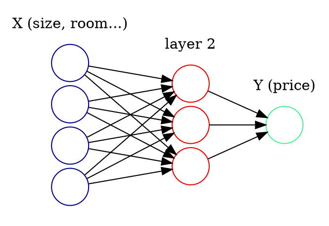

# Neural Networks & Deep learning

## Course by AndrewNg

### 一、概论

* ReLU ： 线性模型

* Given(X,Y)



### 二、神经网络基础

#### 2.1 二分分类

eg:图片 是:$1$；否:$0$.
> $X：$特征向量；$Y：0/1$
> $X$总体为$m$个$X$构成的矩阵;
> $Y$总体为$1$行$m$列矩阵

#### 2.2 Logistic 回归

* $Given : x, \hat y(0\le y \le 1) \{(x^{(1)},y^{(1)}),...,(x^{(m)},y^{(m)}\}, want :\hat y^{(i)} \approx y^{(i)}$
* 参数：$w \in R^X, b \in R$
* $Output: \hat y =\sigma(w^Tx +b)， \sigma (z)=\frac{1}{1+e^{-z}}$

* 损失函数(Loss function):
$$L(\hat y,y)=-(y ln \hat y +(1-y)ln(1-\hat y))$$
    越小越好

* 成本函数(Cost Function):
    $$J(w,b)=\frac{1}{m} \sum^m_{i=1}L(\hat y^{(i)},y^{(i)})$$

#### 2.3 梯度下降法(Gradient Descent)

$$
Repeat\{
	w := w - \alpha \frac{\partial J(w, b)}{\partial w}
	b := b - \alpha \frac{\partial J(w, b)}{\partial b}
\}
$$


通过求导

#### 2.4 向量化

避免`for`循环，加快速度
```py
z = np.dot(w,x)
# numpy 计算(w^T * x)

np.exp(V)
np.abs(V)
np.Maximum(V)
```

```py
z = w^T + b = np.dot(w.T,x) + b
A = sigma(z)
dz = A - Y
dw = 1/m X dz^T
db = 1/m np.sum(dz)

w:= w - adw
b:= b - adb
```

构建矩阵

```py
(x, y)
Tensor(x, y)
```

### 三、浅层神经网络

#### 3.1 神经网络结构

输入层，隐藏层，输出层（总层数隐藏层+输出层）


#### 3.2 激活函数(activation function)

1. $\sigma(z)$:	$\frac{1}{1+e^{-z}}$，函数值在$0-1$之间（仅在二元分类输出层
	


2. $g(z) = tanh(z) = \frac{e^z-e^{-z}}{e^z+e^{-z}}$，双曲正切函数，值介于$-1 到 1$，比sigmoid更优
	

3. $ReLu$:$a = max(0,z)$修正线性函数，分类时隐层激活函数，更加广泛
	

4. $Leaky ReLu$0点有斜率
	


	> 不同层可以用不用的激活函数

## PyTorch

### 一、基础知识

1. Tensor

	两类操作: `torch.`和`tensor.`

	```py
	t.Tensor(5, 3) #创建5x3矩阵（预分配空间）

	ones(x) #全1
	zeros(x) # 全0
	eye(x)	# 单位矩阵
	rand/randn(x, y) # x行y列的均匀/标准分布
	randperm(5) # 长度为5的随机排列

	t.Tensor([[1,2,3],[4,5,6]]) # list创建Tensor

	# Tensor操作

	a.view(2, 3) #重塑为2*3矩阵
	a.squeeze(1) #压缩第一个维度
	a.resize_(3, 3) #调整尺寸，并且多出的数据能够重新分配空间

	# 索引

	a[0] #0行
	a[:, 0] #0列
	a[0][2] #等价于a[0,2]
	a[0, -1] #0行最后一个元素
	a[:2] #前两行
	a[:2, 0:2] #前两行的0-2列
	a[0:1, :2] #0行前两列，返回1*2矩阵
	a[0, :2] #返回值为2个值

	a > 1 #返回符合标准的2进制矩阵
	a[a>1] #返回符合标准的几个值
	```

	```py
	t.linspace(0, 15, 6) #生成0-15共6个等差数列 
	t.max(a, b) #返回矩阵包含a,b间每个元素中最大值构成矩阵
	```

2. Aytograd：(自动微分)

	* `Variable`是核心类，包括三个属性
		>`data`保存`Tensor`;
		>`grad`保存`data`对应梯度;
		>`grad_fn`指向Function
	* `Variable`构造函数需要传入tensor，并有2个可选参数
		>`requires_grad(bool)`，是否要对`Variable`求导
		> `volatile(bool)`，设置为`True`，构建在该`variable`上的图都不会求导，为推理阶段设计

	* 反向传播`variable.backward`有以下参数
		> `grad_variables`形状与`variable`一致，相当于链式法则中的高阶导
		> `retain_graph`:用于缓存中间结果的参数
		> `create_graph`:对于反向传播再次构建计算图
	* 计算图
		> 底层实现采用计算图，参数`requires_grad`选择`True`,变量不选，如$z = wx+b$和$y =wx$ ; $z = y+b$可表示为
		```py
		x = V(t.ones(1))
		b = V(t.rand(1), requires_grad = True)
		w = V(t.rand(1), requires_grad = True) #叶子节点且为参数，需要反向传播改变参数
		y = x * w
		z = y + b

		# 为了多次反向传播，需要retain_graph = True保存buffer

		z.backward(retain_graph = True)
		```

### 二、神经网络工具箱nn