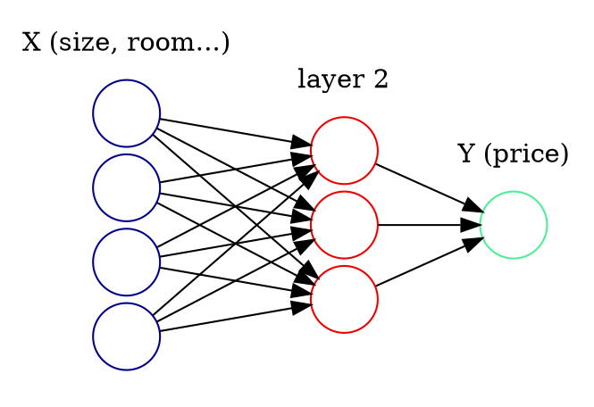

# Neural Networks & Deep learning

## 一、概论

### 1.1 神经网络？

* ReLU ： 线性模型

* Given(X,Y)

```dot
digraph G {
        rankdir=LR
	splines=line
        nodesep=.05;        
        node [label=""];
        
        subgraph cluster_0 {
		color=white;
                node [style=solid,color=blue4, shape=circle];
		x1 x2 x3 x4;
		label = "X (size, room...)";
	}

	subgraph cluster_1 {
		color=white;
		node [style=solid,color=red2, shape=circle];
		a1 a2 a3;
		label = "layer 2";
	}


	subgraph cluster_3 {
		color=white;
		node [style=solid,color=seagreen2, shape=circle];
		O1;
		label="Y (price)";
	}

        x1 -> a1
        x1 -> a2
        x1 -> a3

        x2 -> a1
        x2 -> a2
        x2 -> a3

        x3 -> a1
        x3 -> a2
        x3 -> a3

        x4 -> a1
        x4 -> a2
        x4 -> a3

        a1 -> O1
        a2 -> O1
        a3 -> O1


}
```