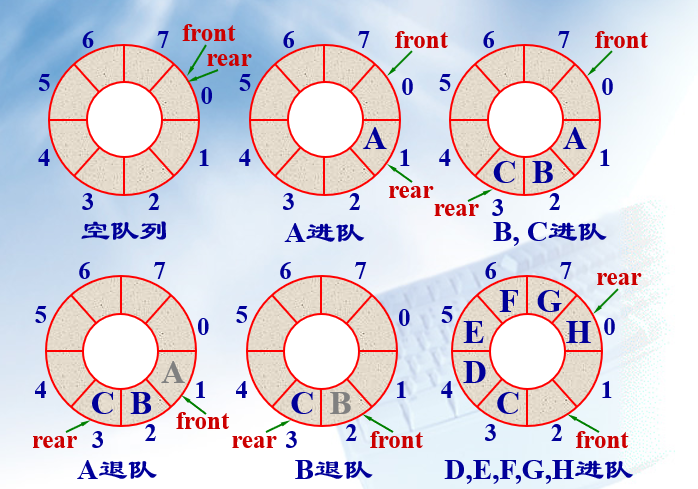
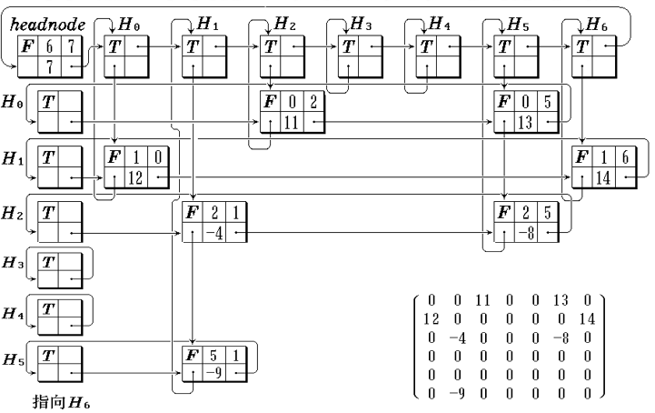
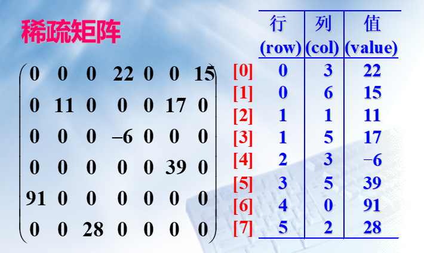

# 数据结构

## 一、绪论

* 数据元素：数据的基本单位，在计算机程序中常作为一个整体进行考虑和处理
* 数据结构：由某一数据对象及该对象中所有数据成员之间的关系组成，是数据的组织形式
    1. 集合结构
    2. 线性结构：线性表,堆栈,队列,串
    3. 树状结构：二叉树，树
    4. 图状结构

* 算法：

    1. 正确性
    2. 具体性
    3. 确定性
    4. 有限性
    5. 可读性
    6. 健壮性

* 算法评价标准

    1. 时间复杂度
        1. O(1)：常数时间复杂度，效率最高
        2. O(n),O(n^2)：多项式阶时间复杂度
        3. O(2^n)：指数时间复杂度，时间最长，算法不实用
        4. O(nlogn)和O(logn)：对数时间复杂度，除常数外效率最高
    2. 空间复杂度：根据存储空间判断

## 二、线性表

### 2.1 线性表逻辑结构

* 定义:
    n个数据元素的有限序列，记作（a1, a2, …, an）
    $$LinearList=(D, R);$$
    D为数据集合，R为前序和后继的联系
* 基本特征：
    简单的线性结构，数据结构的有限集
* 特点：
    第一个和最后一个元素唯一，除首位元素都有唯一的前驱后继  
* 基本操作：

    1. 初始化操作：
        InitList(&L)
    2. 结构销毁操作：
        DestroyList(&L)
    3. 引用型操作:
        Empty(L)    //判空
        Length(L)   //元素数目
        Prior(L, x, &pre)   //返回前驱
        Next( L, x, &next ) //返回后继
        Get( L, i ) //返回第i个元素的值
        Locate( L, x ) //返回第一个与x相等值的位序
    4. 加工型操作：
        Clear( &L ) //清空表
        PutElem( &L, i, x ) //改变数据元素的值
        Insert( &L, i, x )  //插入数据元素
        Delete(&L, i, &x)  //删除数据元素

### 2.2 顺序表

* 定义：将线性表中元素相继放到连续的存储空间中，类似一维数组

* 模板：

```cpp
template <class Type>
class SeqList {
protected:
    Type *data;       //顺序表存储数组
    int MaxSize; //最大允许长度
    int last;      //当前最后元素下标
public:
    SeqList ( int MaxSize = defaultSize );
    ~SeqList ( ) { delete [] data; }
    int Length ( ) const { return last+1; }
    int Locate ( Type x ) const;       //定位
    int Insert ( int i, Type x );      //插入
    int Delete ( int i );              //删除
    int Next ( Type x, Type &next ) ;  //后继
    int Prior ( Type x, Type &pre ) ;  //前驱
    int Empty ( ) { return last ==-1; }
    int Full ( ) { return last == MaxSize-1; }
    Type Get ( int i ) {               //提取
         return i < 0 || i > last？NULL : data[i];
    }
 }
```

部分操作：

* 创建链表：

```cpp
template <class Type>          //构造函数
SeqList<Type> :: SeqList ( int sz ){
if ( sz > 0 ) {
MaxSize = sz;  last = -1;
data = new Type[MaxSize];
if ( data == NULL ) {
    MaxSize = 0;   last = -1;
    return;
        }
    }
}

```

* 插入：时间复杂度O(n)

```cpp
template <class Type>
int SeqList<Type> :: Insert (int i, Type x ) {
//在表中第 i 个位置插入新元素 x
if ( i < 0 || i > last+1 || last == MaxSize-1 )
    return 0;                //插入不成功
else {
    last++;
    for ( int j = last; j > i; j-- )
        data[j] = data[j -1];
    data[i] = x;   return 1;    //插入成功
    }
}
```

* 删除：时间复杂度O(n)

```cpp
template <class Type>
int SeqList<Type> :: Delete ( int i ) {
if ( i <0||i>last ) return 0;
for ( int j = i+1; j <= last; j++ )
    data[j-1] = data[j];
    last—;
    return 1;              //成功删除
}
```

### 2.3 链表

#### 单链表

* 特点：
    1. 每个元素由节点构成  
    2. 存储位置由直接前驱指示
    3. 非随机式的存储结构
    4. 表可扩充
    5. 由节点类和链表类组成

实现如下：

```cpp
class ListNode {       //链表结点类
friend class List;       //链表类为其友元类
private:
    int data;        //结点数据, 整型
    ListNode *link;        //结点指针
 };

//节点也可定义为结构类型

class List {           //链表类定义(嵌套方式)
public:
    //链表操作
private:
    class ListNode {       //嵌套链表结点类
    public:
        int data;
        ListNode *link;
    };
    ListNode *first;  //表头指针
};

```

* 插入：

```cpp
int List::Insert ( const int x, const int i ) {
//在链表第 i 个结点处插入新元素 x
Node *p = first;
int k = 0;
while ( p != NULL && k< i -1 )
    { p = p→link;  k++; }   //找第i-1个结点
if ( p == NULL && first != NULL ) {
    cout << “Invalid position for Insertation!\n”;  return 0;
}
Node *newnode= new Node(x, NULL);
//创建新结点,其数据为x,指针为0
if ( first == NULL || i == 0 ) {  //插在表前
    newnode→link = first;
    if ( first == NULL ) last = newnode;
    first = newnode;
      }
else {                             //插在表中或末尾
    newnode→link = p→link;
if ( p→link == NULL ) last = newnode;
    p→link = newnode;
    }
    return 1;
}
```

* 删除：

```cpp
int List::Remove ( int i ) {
//在链表中删除第i个结点
Node *p = first;  int k = 0;
while ( p != NULL && k< i-1 )
    { p = p→link;  k++; }    //找第i-1个结点
if ( p == NULL ) {
    cout << “Invalid position for Deletion!\n”;
    return 0;
}
```

#### 循环链表

单链表变形，最后一个节点next指针指向头节点，为空的条件为`head -> next == head`

#### 双向链表

指在前驱和后继方向都能游历(遍历)的线性链表，通常采用带表头结点的循环链表形式。

```cpp
p == p→lLink→rLink == p→rLink→lLink
```

插入算法：

```cpp
p→lLink = current;
p→rLink =current→rLink;
current→rLink = p;
current = current→rLink;
current→rLink→lLink = current;
```

删除算法：

```cpp
current→rLink→lLink = current→lLink;
current→lLink→rLink = current→rLink;
```

## 三、堆栈和队列

限定只能在端点操作的线性表

### 1. 栈（Stack）

* 定义：只允许在一段插入和删除，插入的一端叫栈顶，后进先出。

* 顺序栈实现：

```cpp
template <class Type>
class Stack {
private:
    int top;
    Type *elements;
    int maxSize;
public:
    Stack ( int s = 10 );
    ~Stack ( ) { delete [ ]elements; }
    int Push ( Type x );
    int Pop ( Type &x );
    int GetTop ( Type &x );
    void MakeEmpty ( ) { top = -1; }
    int IsEmpty ( ) const { return top == -1; }
    int IsFull ( ) const  
        { return top == maxSize-1; }
}

template <class Type>
Stack<Type> ::Stack ( int s ){
    top= -1; maxSize = s;
    elements = new Type[maxSize];
}

template <class Type>
int  Stack<Type>::Push( Type x ) {
    if (IsFull( )) return 0;
    elements[++top] = x; return 1;
}
template <class Type>
int stack<Type>::Pop( Type & x ) {
    if (IsEmpty( )) return 0;  
    x=elements[top--]; return 1;
}


```

* 链式栈

```cpp
template <class Type> class Stack;
template <class Type> class StackNode {
   friend class Stack<Type>;
   private:
      Type data;
      StackNode<Type> *link;
   public:
      StackNode ( Type d, StackNode<Type>
             *l = NULL ) : data ( d ), link ( l ) { }
};  
template <class Type> class Stack {
   private:
      StackNode<Type> *top;
   public:
      Stack ( ) : top ( NULL ) { }
      ~Stack ( );
    void Push ( Type x );
      int Pop ( Type & x );
      int GetTop ( Type & x );
      void MakeEmpty();//实现与~Stack()同
      int IsEmpty (){ return top == NULL; }
}

template <class Type>  
Stack<Type>::~Stack ( ) {
     StackNode<Type> *p;
     while ( top != NULL )
     { p = top;  top = top->link;  delete p; }
}

template <class Type>  
void Stack<Type>::Push ( Type x ) {
    top = new StackNode<Type> ( x, top );
}
template <class Type>
int Stack<Type>::Pop ( Type & x ) {
    if ( IsEmpty ( ) ) return 0;
    StackNode<Type> *p = top;
    top = top->link; x = p->data;
    delete p;  return 1;
}

```

### 2. 队列（Queue）

* 定义：只允许在一端删除，在另一端插入的顺序表。允许删除的一端叫做队头(front)，允许插入的一端叫做队尾(rear)。先进先出。

* 基本操作：

```cpp
template <class Type>
class Queue {
private:
    int rear, front;
    Type *elements;
    int maxSize;
public:
    Queue ( int sz= 10 );
    ~Queue ( ) { delete [ ]elements; }
    int EnQueue ( Type x );
    int DeQueue ( Type &x );
    int GetFront ( Type &x );
    void MakeEmpty ( ) { front = rear; }
    int IsEmpty ( ) const
       { return front == rear; }
    int IsFull ( ) const
       { return (rear+1) % maxSize == front; }
    int Length ( ) const
       { return (rear-front+maxSize) % maxSize;}
}

```

* 循环队列

    front和rear两个指针指向队头队尾

    

```cpp
template <class Type>
Queue<Type>::Queue( int sz ) :
front (-1), rear (-1), maxSize (sz) {
    elements = new Type[maxSize];
}

template <class Type>
int Queue<Type>::EnQueue( Type x ) {
     if ( IsFull ( ) ) return 0;
     rear = (rear+1) % MaxSize;
     elements[rear] = x; return 1;
}

template <class Type>
int Queue<Type>::DeQueue( Type & x ) {
     if ( IsEmpty ( ) ) return 0;
     front = ( front+1) % MaxSize;
     x = elements[front]; return 1;
}

template <class Type>
int Queue<Type>::GetFront( Type & x ) {
     if ( IsEmpty ( ) ); return 0;
     x = elements[( front+1) % MaxSize];
     Return 1;
}

```

* 链式队列

```cpp
template <class Type> class Queue;
template <class Type> class QueueNode {friend class Queue<Type>;
private:
    Type data;
    QueueNode<Type> *link;
public:
    QueueNode(Type d, QueueNode<Type>
      *l = NULL ) : data (d), link (l) { }
};
template <class Type> class Queue;
template <class Type> class QueueNode {friend class Queue<Type>;
private:  
    Type data;
    QueueNode<Type> *link;
public:
    QueueNode(Type d, QueueNode<Type>
      *l = NULL ) : data (d), link (l) { }
    void EnQueue ( Type x );
    int DeQueue ( Type & x );
    int GetFront (  Type & x );
    void MakeEmpty(); //实现与~Queue()同
    int IsEmpty ( ) const
         { return front == NULL; }
};

```

## 四、串

n(n>=0)个字符的有限序列
术语：

* 空  串n=0的串
* 子  串串中若干相邻字符组成的子序列
* 主  串包含子串的串
* 空格串仅含有空格字符的串(n不为0)

```cpp
StrAssign (&T, chars)       #把 chars 赋为 T 的值
DestroyString(&S)
StrCopy (&T, S)
StrLength(S)
StrCompare (S, T)
Concat (&T, S1, S2)     #用 T 返回由S1和S2联接而成的新串
StrEmpty (S)
SubString (&Sub, S, pos, len)      #用 Sub 返回串 S 的第pos个字符起长度为 len 的子串
ClearString (&S)
Index (S, T, pos)   #若主串 S 中存在和串 T 值相同的子串, 则返回它在主串S中第pos个字符之后第一次出现的位置；否则函数值为0
Replace (&S, T, V)
StrInsert (&S, pos, T)
StrDelete (&S, pos, len)

int Index (String S, String T, int pos) {
//T为非空串。若主串S中第pos个字符
之后存在与 T相等的子串，则返回第
一个这样的子串在S中的位置，否则返回0
  if (pos > 0) {
    n = StrLength(S);
    m = StrLength(T);
    i = pos;
    while ( i <= n-m+1) {
        SubString (sub, S, i, m);
        if (StrCompare(sub,T) != 0)   ++i ;
        else return i ;
     } // while
  } // if
  return 0;  // S中不存在与T相等的子串
} // Index

```

## 五、数组和广义表

### 1. 数组

#### 1.1 一维数组：  相同类型的数据元素的集合。

```cpp
template <class Type>
class Array {
      Type *elements;        //数组存放空间
      int ArraySize;            //当前长度
      void getArray ( );      //建立数组空间
 public:
      Array( int Size=DefaultSize );
      Array( const Array<Type>& x );
      ~Array( ) { delete [ ]elements;}
     Array<Type> &operator= //数组复制
         ( const Array<Type> & A );  
     Type &operator[ ]( int i ); //取元素值
      int Length()const{ return ArraySize; }
                                              //取数组长度
      void ReSize ( int sz );  //扩充数组
 }
```

#### 1.2 多维数组：

一维数组的推广
多维数组是一种非线性结构。其特点是每一个数据元素可以有多个直接前驱和多个直接后继。
数组元素的下标一般具有固定的下界和上界，因此它比其他复杂的非线性结构简单。

* 数组元素遍历：
    1. 以行序位主序：先排最右的下标，依次向左
    2. 以列序位主序：先排最左的下标，依次向右

* 数组定位：
    第一个元素地址为a，各维元素个数为  m1, m2, m3, …, mn下标为 i1, i2, i3, …, in 的数组元素的存储地址：
    $$LOC(i_1,i_2,...,i_n) = a + (\sum^{n-1}_{j=1} i_j * \prod^n_{k=j+1}m_k +i_n )$$

#### 1.3 稀疏矩阵：

非零元素个数远远少于矩阵元素个数的矩阵
假设 m 行 n 列的矩阵含 t 个非零元素，则称$\delta = \frac{t}{m \times n}$为稀疏因子。通常认为稀疏因子小于等于0.05的矩阵为稀疏矩阵
常规方法表示会浪费空间

可分为：特殊矩阵（非零元在矩阵中的分布有一定规则，如: 对称矩阵；三角矩阵；三对角矩阵）和随机稀疏矩阵

顺序压缩：三元组表示法；带辅助行向量的二元组表示法；伪地址表示法
链式压缩：带行指针向量的单链表示法；行—列表示法；十字链表

**正交链表法：**行链表与列链表十字交叉，二者都是带表头节点的循环链表，用表头节点表征是第几行第几列。



**三元组法**：

可直接用来求矩阵转置



### 2. 广义表

定义：n个表元素组成的有限序列,记作 LS = (a0, a1, a2, …, an-1)LS是表名,ai是表元素,它可以是表(称为子表),可以是数据元素(称为原子)。是递归定义的**线性结构**。如G=((a,(b,c)),x,(y,z))

结构特点：

1. 数据元素有相对次序
2. 广义表的长度定义为最外层包含元素个数
3. 广义表的深度定义为所含括弧的重数“原子”的深度为 0 ,“空表”的深度为 1
4. 可以是一个递归的表 
5. 任何一个非空广义表LS = ( a1, a2, …, an) 均可分解为
   表头  Head(LS) = a1   和
   表尾  Tail(LS) = ( a2, …, an) 两部分

广义表结点定义:
结点类型 utype  = 0, 表头；= 1, 整型原子；= 2, 字符型原子；= 3, 子表


## 六、树和二叉树

n大于等于0个元素的有限集合。

* 节点的层次：根节点层次为1，叶节点+其据根节点距离
* 树的深度：树的最大节点层次。

森林：互不相交的树集合