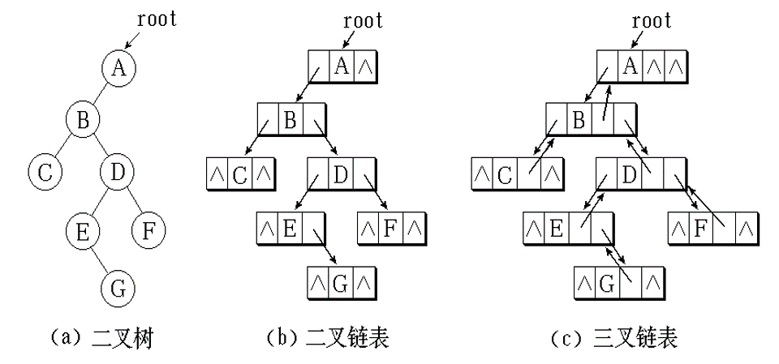
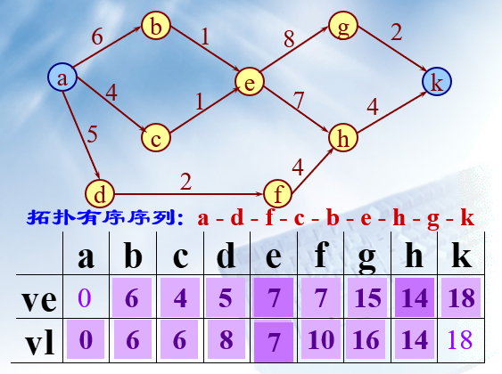
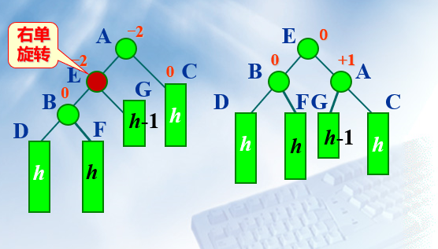
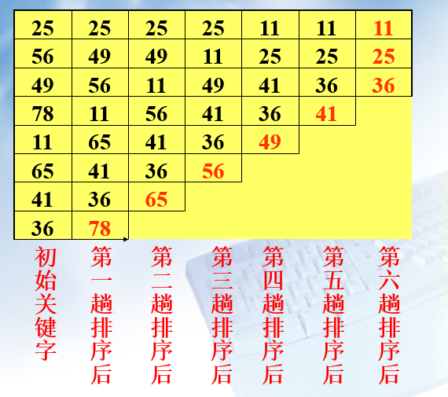
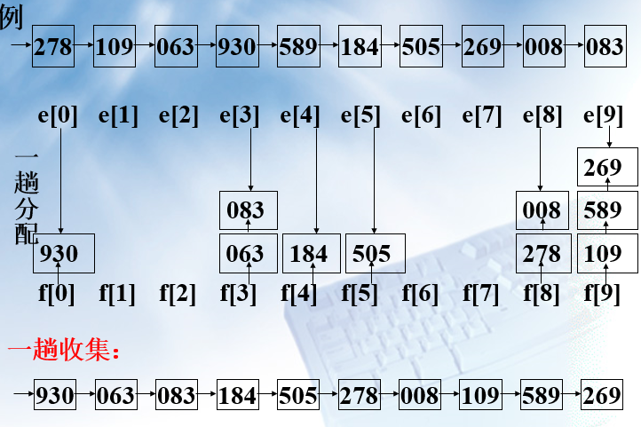

# 数据结构

## 一、绪论

* 数据元素：数据的基本单位，在计算机程序中常作为一个整体进行考虑和处理
* 数据结构：由某一数据对象及该对象中所有数据成员之间的关系组成，是数据的组织形式
    1. 集合结构
    2. 线性结构：线性表,堆栈,队列,串
    3. 树状结构：二叉树，树
    4. 图状结构

* 算法：

    1. 正确性
    2. 具体性
    3. 确定性
    4. 有限性
    5. 可读性
    6. 健壮性

* 算法评价标准

    1. 时间复杂度
        1. O(1)：常数时间复杂度，效率最高
        2. O(n),O(n^2)：多项式阶时间复杂度
        3. O(2^n)：指数时间复杂度，时间最长，算法不实用
        4. O(nlogn)和O(logn)：对数时间复杂度，除常数外效率最高
    2. 空间复杂度：根据存储空间判断

## 二、线性表

### 2.1 线性表逻辑结构

* 定义:
    n个数据元素的有限序列，记作（a1, a2, …, an）
    $$LinearList=(D, R);$$
    D为数据集合，R为前序和后继的联系
* 基本特征：
    简单的线性结构，数据结构的有限集
* 特点：
    第一个和最后一个元素唯一，除首位元素都有唯一的前驱后继  
* 基本操作：

    1. 初始化操作：
        InitList(&L)
    2. 结构销毁操作：
        DestroyList(&L)
    3. 引用型操作:
        Empty(L)    //判空
        Length(L)   //元素数目
        Prior(L, x, &pre)   //返回前驱
        Next( L, x, &next ) //返回后继
        Get( L, i ) //返回第i个元素的值
        Locate( L, x ) //返回第一个与x相等值的位序
    4. 加工型操作：
        Clear( &L ) //清空表
        PutElem( &L, i, x ) //改变数据元素的值
        Insert( &L, i, x )  //插入数据元素
        Delete(&L, i, &x)  //删除数据元素

### 2.2 顺序表

* 定义：将线性表中元素相继放到连续的存储空间中，类似一维数组

* 模板：

```cpp
template <class Type>
class SeqList {
protected:
    Type *data;       //顺序表存储数组
    int MaxSize; //最大允许长度
    int last;      //当前最后元素下标
public:
    SeqList ( int MaxSize = defaultSize );
    ~SeqList ( ) { delete [] data; }
    int Length ( ) const { return last+1; }
    int Locate ( Type x ) const;       //定位
    int Insert ( int i, Type x );      //插入
    int Delete ( int i );              //删除
    int Next ( Type x, Type &next ) ;  //后继
    int Prior ( Type x, Type &pre ) ;  //前驱
    int Empty ( ) { return last ==-1; }
    int Full ( ) { return last == MaxSize-1; }
    Type Get ( int i ) {               //提取
         return i < 0 || i > last？NULL : data[i];
    }
 }
```

部分操作：

* 创建链表：

```cpp
template <class Type>          //构造函数
SeqList<Type> :: SeqList ( int sz ){
if ( sz > 0 ) {
MaxSize = sz;  last = -1;
data = new Type[MaxSize];
if ( data == NULL ) {
    MaxSize = 0;   last = -1;
    return;
        }
    }
}

```

* 插入：时间复杂度O(n)

```cpp
template <class Type>
int SeqList<Type> :: Insert (int i, Type x ) {
//在表中第 i 个位置插入新元素 x
if ( i < 0 || i > last+1 || last == MaxSize-1 )
    return 0;                //插入不成功
else {
    last++;
    for ( int j = last; j > i; j-- )
        data[j] = data[j -1];
    data[i] = x;   return 1;    //插入成功
    }
}
```

* 删除：时间复杂度O(n)

```cpp
template <class Type>
int SeqList<Type> :: Delete ( int i ) {
if ( i <0||i>last ) return 0;
for ( int j = i+1; j <= last; j++ )
    data[j-1] = data[j];
    last—;
    return 1;              //成功删除
}
```

### 2.3 链表

#### 单链表

* 特点：
    1. 每个元素由节点构成  
    2. 存储位置由直接前驱指示
    3. 非随机式的存储结构
    4. 表可扩充
    5. 由节点类和链表类组成

实现如下：

```cpp
class ListNode {       //链表结点类
friend class List;       //链表类为其友元类
private:
    int data;        //结点数据, 整型
    ListNode *link;        //结点指针
 };

//节点也可定义为结构类型

class List {           //链表类定义(嵌套方式)
public:
    //链表操作
private:
    class ListNode {       //嵌套链表结点类
    public:
        int data;
        ListNode *link;
    };
    ListNode *first;  //表头指针
};

```

* 插入：

```cpp
int List::Insert ( const int x, const int i ) {
//在链表第 i 个结点处插入新元素 x
Node *p = first;
int k = 0;
while ( p != NULL && k< i -1 )
    { p = p→link;  k++; }   //找第i-1个结点
if ( p == NULL && first != NULL ) {
    cout << “Invalid position for Insertation!\n”;  return 0;
}
Node *newnode= new Node(x, NULL);
//创建新结点,其数据为x,指针为0
if ( first == NULL || i == 0 ) {  //插在表前
    newnode→link = first;
    if ( first == NULL ) last = newnode;
    first = newnode;
      }
else {                             //插在表中或末尾
    newnode→link = p→link;
if ( p→link == NULL ) last = newnode;
    p→link = newnode;
    }
    return 1;
}
```

* 删除：

```cpp
int List::Remove ( int i ) {
//在链表中删除第i个结点
Node *p = first;  int k = 0;
while ( p != NULL && k< i-1 )
    { p = p→link;  k++; }    //找第i-1个结点
if ( p == NULL ) {
    cout << “Invalid position for Deletion!\n”;
    return 0;
}
```

#### 循环链表

单链表变形，最后一个节点next指针指向头节点，为空的条件为`head -> next == head`

#### 双向链表

指在前驱和后继方向都能游历(遍历)的线性链表，通常采用带表头结点的循环链表形式。

```cpp
p == p→lLink→rLink == p→rLink→lLink
```

插入算法：

```cpp
p→lLink = current;
p→rLink =current→rLink;
current→rLink = p;
current = current→rLink;
current→rLink→lLink = current;
```

删除算法：

```cpp
current→rLink→lLink = current→lLink;
current→lLink→rLink = current→rLink;
```

## 三、堆栈和队列

限定只能在端点操作的线性表

### 1. 栈（Stack）

* 定义：只允许在一段插入和删除，插入的一端叫栈顶，后进先出。

* 顺序栈实现：

```cpp
template <class Type>
class Stack {
private:
    int top;
    Type *elements;
    int maxSize;
public:
    Stack ( int s = 10 );
    ~Stack ( ) { delete [ ]elements; }
    int Push ( Type x );
    int Pop ( Type &x );
    int GetTop ( Type &x );
    void MakeEmpty ( ) { top = -1; }
    int IsEmpty ( ) const { return top == -1; }
    int IsFull ( ) const  
        { return top == maxSize-1; }
}

template <class Type>
Stack<Type> ::Stack ( int s ){
    top= -1; maxSize = s;
    elements = new Type[maxSize];
}

template <class Type>
int  Stack<Type>::Push( Type x ) {
    if (IsFull( )) return 0;
    elements[++top] = x; return 1;
}
template <class Type>
int stack<Type>::Pop( Type & x ) {
    if (IsEmpty( )) return 0;  
    x=elements[top--]; return 1;
}


```

* 链式栈

```cpp
template <class Type> class Stack;
template <class Type> class StackNode {
   friend class Stack<Type>;
   private:
      Type data;
      StackNode<Type> *link;
   public:
      StackNode ( Type d, StackNode<Type>
             *l = NULL ) : data ( d ), link ( l ) { }
};  
template <class Type> class Stack {
   private:
      StackNode<Type> *top;
   public:
      Stack ( ) : top ( NULL ) { }
      ~Stack ( );
    void Push ( Type x );
      int Pop ( Type & x );
      int GetTop ( Type & x );
      void MakeEmpty();//实现与~Stack()同
      int IsEmpty (){ return top == NULL; }
}

template <class Type>  
Stack<Type>::~Stack ( ) {
     StackNode<Type> *p;
     while ( top != NULL )
     { p = top;  top = top->link;  delete p; }
}

template <class Type>  
void Stack<Type>::Push ( Type x ) {
    top = new StackNode<Type> ( x, top );
}
template <class Type>
int Stack<Type>::Pop ( Type & x ) {
    if ( IsEmpty ( ) ) return 0;
    StackNode<Type> *p = top;
    top = top->link; x = p->data;
    delete p;  return 1;
}

```

### 2. 队列（Queue）

* 定义：只允许在一端删除，在另一端插入的顺序表。允许删除的一端叫做队头(front)，允许插入的一端叫做队尾(rear)。先进先出。

* 基本操作：

```cpp
template <class Type>
class Queue {
private:
    int rear, front;
    Type *elements;
    int maxSize;
public:
    Queue ( int sz= 10 );
    ~Queue ( ) { delete [ ]elements; }
    int EnQueue ( Type x );
    int DeQueue ( Type &x );
    int GetFront ( Type &x );
    void MakeEmpty ( ) { front = rear; }
    int IsEmpty ( ) const
       { return front == rear; }
    int IsFull ( ) const
       { return (rear+1) % maxSize == front; }
    int Length ( ) const
       { return (rear-front+maxSize) % maxSize;}
}

```

* 循环队列

    front和rear两个指针指向队头队尾

    

```cpp
template <class Type>
Queue<Type>::Queue( int sz ) :
front (-1), rear (-1), maxSize (sz) {
    elements = new Type[maxSize];
}

template <class Type>
int Queue<Type>::EnQueue( Type x ) {
     if ( IsFull ( ) ) return 0;
     rear = (rear+1) % MaxSize;
     elements[rear] = x; return 1;
}

template <class Type>
int Queue<Type>::DeQueue( Type & x ) {
     if ( IsEmpty ( ) ) return 0;
     front = ( front+1) % MaxSize;
     x = elements[front]; return 1;
}

template <class Type>
int Queue<Type>::GetFront( Type & x ) {
     if ( IsEmpty ( ) ); return 0;
     x = elements[( front+1) % MaxSize];
     Return 1;
}

```

* 链式队列

```cpp
template <class Type> class Queue;
template <class Type> class QueueNode {friend class Queue<Type>;
private:
    Type data;
    QueueNode<Type> *link;
public:
    QueueNode(Type d, QueueNode<Type>
      *l = NULL ) : data (d), link (l) { }
};
template <class Type> class Queue;
template <class Type> class QueueNode {friend class Queue<Type>;
private:  
    Type data;
    QueueNode<Type> *link;
public:
    QueueNode(Type d, QueueNode<Type>
      *l = NULL ) : data (d), link (l) { }
    void EnQueue ( Type x );
    int DeQueue ( Type & x );
    int GetFront (  Type & x );
    void MakeEmpty(); //实现与~Queue()同
    int IsEmpty ( ) const
         { return front == NULL; }
};

```

## 四、串

n(n>=0)个字符的有限序列
术语：

* 空  串n=0的串
* 子  串串中若干相邻字符组成的子序列
* 主  串包含子串的串
* 空格串仅含有空格字符的串(n不为0)

```cpp
StrAssign (&T, chars)       #把 chars 赋为 T 的值
DestroyString(&S)
StrCopy (&T, S)
StrLength(S)
StrCompare (S, T)
Concat (&T, S1, S2)     #用 T 返回由S1和S2联接而成的新串
StrEmpty (S)
SubString (&Sub, S, pos, len)      #用 Sub 返回串 S 的第pos个字符起长度为 len 的子串
ClearString (&S)
Index (S, T, pos)   #若主串 S 中存在和串 T 值相同的子串, 则返回它在主串S中第pos个字符之后第一次出现的位置；否则函数值为0
Replace (&S, T, V)
StrInsert (&S, pos, T)
StrDelete (&S, pos, len)

int Index (String S, String T, int pos) {
//T为非空串。若主串S中第pos个字符
之后存在与 T相等的子串，则返回第
一个这样的子串在S中的位置，否则返回0
  if (pos > 0) {
    n = StrLength(S);
    m = StrLength(T);
    i = pos;
    while ( i <= n-m+1) {
        SubString (sub, S, i, m);
        if (StrCompare(sub,T) != 0)   ++i ;
        else return i ;
     } // while
  } // if
  return 0;  // S中不存在与T相等的子串
} // Index

```

## 五、数组和广义表

### 1. 数组

#### 1.1 一维数组：  相同类型的数据元素的集合。

```cpp
template <class Type>
class Array {
      Type *elements;        //数组存放空间
      int ArraySize;            //当前长度
      void getArray ( );      //建立数组空间
 public:
      Array( int Size=DefaultSize );
      Array( const Array<Type>& x );
      ~Array( ) { delete [ ]elements;}
     Array<Type> &operator= //数组复制
         ( const Array<Type> & A );  
     Type &operator[ ]( int i ); //取元素值
      int Length()const{ return ArraySize; }
                                              //取数组长度
      void ReSize ( int sz );  //扩充数组
 }
```

#### 1.2 多维数组：

一维数组的推广
多维数组是一种非线性结构。其特点是每一个数据元素可以有多个直接前驱和多个直接后继。
数组元素的下标一般具有固定的下界和上界，因此它比其他复杂的非线性结构简单。

* 数组元素遍历：
    1. 以行序位主序：先排最右的下标，依次向左
    2. 以列序位主序：先排最左的下标，依次向右

* 数组定位：
    第一个元素地址为a，各维元素个数为  m1, m2, m3, …, mn下标为 i1, i2, i3, …, in 的数组元素的存储地址：
    $$LOC(i_1,i_2,...,i_n) = a + (\sum^{n-1}_{j=1} i_j * \prod^n_{k=j+1}m_k +i_n )$$

#### 1.3 稀疏矩阵：

非零元素个数远远少于矩阵元素个数的矩阵
假设 m 行 n 列的矩阵含 t 个非零元素，则称$\delta = \frac{t}{m \times n}$为稀疏因子。通常认为稀疏因子小于等于0.05的矩阵为稀疏矩阵
常规方法表示会浪费空间

可分为：特殊矩阵（非零元在矩阵中的分布有一定规则，如: 对称矩阵；三角矩阵；三对角矩阵）和随机稀疏矩阵

顺序压缩：三元组表示法；带辅助行向量的二元组表示法；伪地址表示法
链式压缩：带行指针向量的单链表示法；行—列表示法；十字链表

**正交链表法**：行链表与列链表十字交叉，二者都是带表头节点的循环链表，用表头节点表征是第几行第几列。


**三元组法**：

可直接用来求矩阵转置


### 2. 广义表

定义：n个表元素组成的有限序列,记作 LS = (a0, a1, a2, …, an-1)LS是表名,ai是表元素,它可以是表(称为子表),可以是数据元素(称为原子)。是递归定义的**线性结构**。如G=((a,(b,c)),x,(y,z))

结构特点：

1. 数据元素有相对次序
2. 广义表的长度定义为最外层包含元素个数
3. 广义表的深度定义为所含括弧的重数“原子”的深度为 0 ,“空表”的深度为 1
4. 可以是一个递归的表 
5. 任何一个非空广义表LS = ( a1, a2, …, an) 均可分解为
   表头  Head(LS) = a1   和
   表尾  Tail(LS) = ( a2, …, an) 两部分

广义表结点定义:
结点类型 utype  = 0, 表头；= 1, 整型原子；= 2, 字符型原子；= 3, 子表


## 六、树和二叉树

### 树

n大于等于0个元素的有限集合。

* 节点的层次：根节点层次为1，叶节点+其据根节点距离
* 树的深度：树的最大节点层次。

森林：互不相交的树集合

存储结构：
一、广义表表示法


二、双亲表示法


三、孩子表示法


四、孩子兄弟表示法 


树的遍历：

* 深度优先遍历

    树的先根次序遍历
    树的后根次序遍历

* 广度优先遍历
    树的层次次序遍历

    

### 二叉树

定义：或为空树，或是由根节点加上称为左子树和右子树的、互不交叉的二叉树组成的。

主要基本操作：

```cpp
Root(T)    Value(T, e)    Parent(T, e)
LeftChild(T, e)  　 RightChild(T, e)
LeftSibling(T, e)     RightSibling(T, e)
BiTreeEmpty(T)　BiTreeDepth(T)
PreOrderTraverse(T, Visit())
InOrderTraverse(T, Visit())
PostOrderTraverse(T, Visit())
LevelOrderTraverse(T, Visit())
InitBiTree(&T)
Assign(T, &e, value)
CreateBiTree(&T, definition)
InsertChild(T, p, LR, c)
ClearBiTree(&T) 
DestroyBiTree(&T)
DeleteChild(T, p, LR)

```

分类：

1. 满二叉树：指的是深度为$k$且含有$2^k-1$个结点的二叉树
2. 完全二叉树：从左向右，从上到下依次排列的满二叉树一部分
    具有n个结点的完全二叉树的深度为[log2n] +1

存储结构：

1. 顺序存储

    

    可能会浪费很多存储空间

2. 链式存储

    

**二叉树的遍历**:

访问根结点      记作   V
遍历根的左子树  记作   L
遍历根的右子树  记作   R

* 前序遍历  VLR
* 中序遍历  LVR
* 后序遍历  LRV
* 层次遍历：由上到下，从左到右依次

* 由二叉树的前序序列和中序序列可以唯一地确定一棵二叉树
* 由二叉树的后序序列和中序序列可以唯一地确定一棵二叉树
* 由二叉树的前序序列和后序序列不可唯一地确定一棵二叉树

类定义：

```cpp
template <class Type>
class BinTreeNode {
private:
    BinTreeNode<Type> *LChild,*RChild;
    Type data; }
template <class Type>
class BinaryTree {
private:
    BinTreeNode<Type> *root; };  

#二叉树前序遍历递归算法
template <class Type>
void BinaryTree<Type>::PreOrder(BinTreeNode<Type>*current)
{ if ( current != NULL )
   { cout << current→data;
      PreOrder ( current→LChild );
      PreOrder ( current→RChild ); }
}

#二叉树中序遍历递归算法
template <class Type>
void BinaryTree <Type>::
    InOrder(BinTreeNode<Type>*current) { if ( current != NULL )
   { InOrder ( current→LChild );
     cout << current→data;
     InOrder ( current→RChild ); }
}

#二叉树后序遍历递归算法
template <class Type>
void BinaryTree<Type>::
 PostOrder(BinTreeNode<Type>*current) { if ( current != NULL ) {
   PostOrder ( current→LChild );
   PostOrder ( current→RChild );
   cout << current→data; }
}

#非遍历算法（中序）
template <class Type>
void BinaryTree<Type>::PreOrder(BinTreeNode<Type> *p )
{ do
   { while (  p != NULL )
      { Push ( s, p );  p = p→LChild; }  
      if ( !Empty ( s ) )
        { p = pop ( s );
        cout << p→data;
        p = p→RChild; }
   }while ( ( !Empty ( s ) ) || ( p != NULL ) ) 
}
```

线索二叉树：
在二叉链表的结点中增加两个标志域LTag和RTag,并作如下规定:
LTag = 0, LChild为指针,指向左孩子
LTag = 1, LChild为线索,指向前驱
RTag = 0, RChild为指针,指向右孩子
RTag = 1, RChild为线索,指向后继


哈夫曼树：
带权路径长度取最小值的树，称为“最优树”,或“哈夫曼树”(Huffman Tree)
构造：

1. 连接权为w1,w2的两片树叶，得一个分支点，其权为w1+w2；
2. 在w1+w2，w3, …,wt中选出两个最小的权，连接它们对应的顶点（不一定是树叶），得新分枝点及所带的权；
3. 重复2，直到形成t－1个分支点，t片树叶为止。

哈夫曼编码：左道路表0，右道路标1，从根读取道路编码作为目的节点的哈夫曼编码

## 七、图

由顶点和边组成的有限集合

图的存储表示:

1. 图的数组(邻接矩阵)存储表示

    

2. 图的邻接表存储表示

    

**图的遍历**:

1. 深度优先遍历DFS (Depth First Search)

    

2. 广度优先遍历BFS (Breadth First Search)

    

最小代价生成树：

* 普里姆（Prim）算法：
    1. 取图中任意一个顶点v作为生成树的根，之后往生成树上添加新的顶点w
    2. 在添加的顶点w和已经在生成树上的顶点v之间必定存在一条边，并且该边的权值在所有连通顶点v和w之间的边中取值最小
    3. 之后继续往生成树上添加顶点，直至生成树上含有 n-1个顶点为止
    时间复杂度为O(n2),适用于边较多的稠密图
* 克鲁斯卡尔(Kruskal)算法： 
    1. 选取$G$中权最小的边设为$e1，S={e1}，i=1$
    2. 若$i=n-1$,输出边集$G（S）$，结束
    3. 选$E-S$中不与当前边集构成圈的最小边加入$S$，转2
    时间复杂度为O(eloge)，此算法适用于边较少的稀疏图。

活动网络 ( Activity Network )：

* 用顶点表示活动的网络( AOV网络 )( Activity  On Vertices )

    拓扑排序：
    按照有向图给出的次序关系，将图中顶点排成一个线性序列，对于有向图中没有限定次序关系的顶点，则可以人为加上任意的次序关系

    1. 从有向图中选取一个没有前驱的顶点，并输出之
    2. 从有向图中删去此顶点以及所有以它为尾的弧

        

        

* 用边表示活动的网络( AOE网络 )( Activity On Edges )：

    用有向边表示一个工程中的活动 (Activity),   用边上权值表示活动持续时间  (Duration),   用顶点表示事件 (Event)
    “关键活动”指的是： 该弧上的权值增加将使有向图上的最长路径的长度增加
    **关键路径**：最长路径

    

    假设第 i 条弧为 <j, k>
    对第 j 个顶点而言
    “事件(顶点)”的最早发生时间 ve(j)
    “事件(顶点)”的最迟发生时间 vl(k)
    对第 i 项活动而言
    “活动(弧)”的最早开始时间 ee(i)
    “活动(弧)”的最迟开始时间 el(i)
    ee(i) = ve(j)
    el(i) = vl(k) – dut(<j,k>)

    ve(源点) = vl(源点) = 0
    vl(汇点) = ve(汇点)

    关键活动:el(i) = ee(i)

    

    

最短路径：

* Dijkstra算法：提出按路径长度的递增次序, 逐步产生最短路径的算法。首先求出长度最短的一条最短路径，再参照它求出长度次短的一条最短路径，依次类推，直到从顶点v到其它各顶点的最短路径全部求出为止

    

* 弗洛伊德（Floyd）算法：

    从 vi 到 vj 的所有可能存在的路径中，选出一条长度最短的路径
    若<vi,vj>存在，则存在路径{vi,vj}
                  // 路径中不含其它顶点
    若<vi,v1>,<v1,vj>存在，则存在路径{vi,v1,vj}
             // 路径中所含顶点序号不大于1
    若{vi,…,v2}, {v2,…,vj}存在，
    则存在一条路径{vi, …, v2, …vj}
             // 路径中所含顶点序号不大于2

## 八、查找

在数据集合中寻找符合要求的数据对象

静态环境  搜索结构在插入和删除等操作的前后不发生改变：静态搜索表 
动态环境  为保持较高的搜索效率, 搜索结构在执行插入和删除等操作的前后将自动进行调整，结构可能发生变化：动态搜索表

查找算法的平均查找长度(Average Search Length) ：为确定记录在查找表中的位置，需和给定值进行比较的关键字个数的期望值

### 1. 顺序查找

查找成功:最少比较次数　  1
           最多比较次数　  n　
           平均比较次数 (n+1)/2
  查找失败:最少比较次数   n+1
           最多比较次数   n+1
           平均比较次数   n+1

### 2. 折半查找

以有序表表示静态查找表，查找过程可以基于“折半”进行

* 设n个对象存放在一个有序顺序表中，并按其关键码从小到大排好了序
* 先求位于搜索区间正中的对象的下标mid，用其关键码与给定值x比较
    1. Element[mid].key==x  搜索成功
    2. Element[mid].key>x  把搜索区间缩小到表的前半部分，继续折半搜索
    3. Element[mid].key<x  把搜索区间缩小到表的后半部分，继续折半搜索
    如果搜索区间已缩小到一个对象，仍未找到想要搜索的对象，则搜索失败

    成功$$ASL\approx log_2(n+1)-1$$

    

### 3. 二叉排序树

动态查找方法，或者是一棵空树；或者是具有如下特性的二叉树

1. 若它的左子树不空，则左子树上所有结点的值均小于根结点的值
2. 若它的右子树不空，则右子树上所有结点的值均大于根结点的值
3. 它的左、右子树也都分别是二叉排序树

若二叉排序树为空，则查找不成功，否则：

1. 若给定值等于根结点的关键字，则查找成功
2. 若给定值小于根结点的关键字，则继续在左子树上进行查找
3. 若给定值大于根结点的关键字，则继续在右子树上进行查找

    

### 4. 二叉平衡树（AVL树）

一棵AVL树或者是空树，或者是具有下列性质的二叉搜索树：它的左子树和右子树都是AVL树，且左子树和右子树的高度之差的绝对值不超过1

结点的平衡因子：每个结点附加一个数字, 给出该结点右子树的高度减去左子树的高度所得的高度差, 这个数字即为结点的平衡因子（AVL中只能取-1, 0, 1）

平衡化旋转：如果在一棵平衡的二叉搜索树中插入一个新结点，造成了不平衡。此时必须调整树的结构，使之平衡化

每插入一个新结点时,  AVL 树中相关结点的平衡状态会发生改变。因此,在插入一 个新结点后，需要从插入位置沿通向根的路径回溯，检查各结点的平衡因子。如果在某一结点发现高度不平衡，停止回溯。从发生不平衡的结点起，沿刚才回溯的路径取直接下两层的结点。

* 如果这三个结点处于一条直线上，则采用单旋转进行平衡化    单旋转可按其方向分为左单旋转和右单旋转, 其中一个是另一 个的镜像,其方向与不平衡的形状相关
* 如果这三个结点处于一条折线上，则采用双旋转进行平衡化    双旋转分为先左后右和先右后左两类

    1. LL型：以结点B为旋转轴，将结点A顺时针旋转

        

    2. RR型：以结点C为旋转轴，将结点A反时针旋转

        

    3. LR型：首先以结点E为旋转轴，将结点B反时针旋转，以E代替原来B的位置做左单旋转。再以结点E为旋转轴，将结点A顺时针旋转，做右单旋转

        

        

    4. RL型：首先以结点D为旋转轴，将结点C顺时针旋转，以D代替原来C的位置,做右单旋转。再以结点D为旋转轴，将结点A反时针旋转，做左单旋转

        

        

### 5. 哈希（Hash）查找

在一般情况下，需在关键字与记录在表中的存储位置之间建立一个函数关系，以 H(key) 作为关键字为 key 的记录在表中的位置，通常称这个函数 H(key) 为哈希函数：将关键字的集合映射到某个地址集合上

根据设定的哈希函数 H( key ) 和所选处理冲突的方法，将一组关键字映象到一个有限的、地址连续的地址集 ( 区间)  上，并以关键字在地址集中的“映象”作为相应记录在表中的存储位置，如此构造所得的查找表称为**哈希表**。


哈希表的平均查找长度是a的函数，而不是n的函数

## 九、排序

将一组“无序”的记录序列调整为“有序”的记录序列

* 数据表(datalist): 是待排序数据对象的有限集合。
* 关键码：数据对象的一个属性域可用来区分对象，作为排序依据。该域即为关键码。（主关键码，次关键码）
* 时间开销: 是衡量算法好坏的最重要的标志，可用算法执行中的数据比较次数与数据移动次数来衡量。
* 排序算法的稳定性: 如果在对象序列中有两个对象R[i]和R[j]，它们的关键码 k[i] == k[j]，且在排序之前，对象R[i]排在R[j]前面。如果在排序之后，对象R[i]仍在对象R[j]的前面，则称这个排序方法是稳定的，否则称这个排序方法是不稳定的。
* 内部排序，外部排序：不需要访问外存称为内部排序，否则为外部。

### 内部排序方法


1. 直接插入排序
    整个排序过程为n-1趟插入，即先将序列中第1个记录看成是一个有序子序列，然后从第2个记录开始，逐个进行插入，直至整个序列有序。

    

    * 时间复杂度为O(n2)

2. 希尔排序（缩小增量排序）
    先取一个正整数d1<n，把所有相隔d1的记录作为一组，组内进行直接插入排序；然后取d2<d1，重复上述分组和排序操作；直至di=1，即所有记录放进一个组中排序为止。

    

3. 冒泡排序(Bubble Sorting)
    第一趟：第1个与第2个比较，大则交换；第2个与第3个比较， 大则交换，……关键字最大的记录交换到第n个位置上；
    第二趟：对前n-1个记录进行同样的操作，关键字次大的记录交换到第n-1个位置上；
    依次类推，则完成排序。

    

4. 快速排序(Quick Sorting)
    通过一趟排序，将待排序记录分割成独立的两部分，其中一部分记录的关键字均比另一部分记录的关键字小，则可分别对这两部分记录进行排序，以达到整个序列有序。

    * 初始时令i=s, j=t；
    * 首先从j所指位置向前搜索第一个关键字小于x的记录，并和rp交换；
    * 再从i所指位置起向后搜索，找到第一个关键字大于x的记录，和rp交换；
    * 重复上述两步，直至i==j为止；
    * 再分别对两个子序列进行快速排序，直到每个子序列只含有一个记录为止。

    

5. 简单选择排序
    首先从第1~n个记录中选出关键字最小的记录交换到第一个位置上。然后再从第2~n 个记录元素中选出次小的记录交换到第二个位置上，依次类推；

    不稳定，时间复杂度$O(n^2)$

6. 堆排序(Heap Sorting)
    堆是满足下列性质的数列${r_1,r_2, …,r_n}$
    $$r_i\le r_{2i},r_i\le r_{2i-1} (小顶堆)$$
    $$r_i\ge r_{2i},r_i\ge r_{2i-1} (大顶堆)$$
    **堆排序**即是利用堆的特性对记录序列进行排序的一种排序方法。
    将无序序列建成一个堆，得到关键字最小（大）的记录；输出堆顶的最小（大值后，使剩余的n-1个元素重又建成一个堆，则可得到n个元素的次小（大）值；重复执行，得到一个有序序列，这个过程叫堆排序。
    * 筛选的方法
        输出堆顶元素之后，以堆中最后一个元素替代之；
        将根结点值与左、右子树的根结点值比较，并与其中最大者进行交换；
        重复上述操作，直至叶子结点，将得到新的堆。
        这个从堆顶至叶子的调整过程为“筛选”

    * 建堆是一个从下往上进行“筛选”的过程
        

7. 归并排序(Merge Sorting)
    将两个或两个以上的有序序列 “合成” 为一个有序序列的过程称为“归并” 。
        

8. 基数排序(Radix Sorting)
    借助“分配”和“收集”对单逻辑关键字进行排序的一种方法；
    * 最高位优先MSD法

    * 最低位优先LSD法
    
    
    

