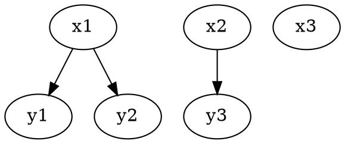
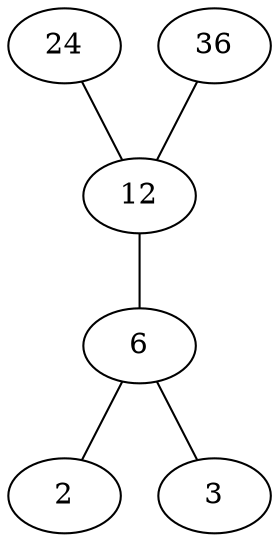

# 离散数学

## 一、数理逻辑

### 1. 命题逻辑

**命题**：能够确切判断结论真假的陈述句。

连结词与标识符：$\sim, \land, \vee, \to, \leftrightarrow, \triangledown, \uparrow, \downarrow$  
分别为非，合取，析取，如果...则，当且仅当，不可兼或，与非，或非  
最小功能完备集：$\{ \uparrow \}, \{ \downarrow \}, \{ \sim, \land \}, \{ \sim ,\vee \}$  
永真式：重言式 $T$；  矛盾式：$F$  

原子公式与否定为句节，有限个句节析取式称**子句**，其合取式为**合取范式**；有限句节合取式称**短语**，其析取式为**析取范式**。  

极大（小）项：包含每个命题变元成假（真）赋值的析（合）取范式  
> 如 $p q v$ 取0时命题为假（真），极大项为$p\vee q \vee r$，极小项为$\sim p \land \sim q \land \sim r$  

**主合（析）取范式**：找出使公式取值为0（1）的全部解释，其极大（小）项的合（析）取范式。每个命题唯一。  

**命题公式的等价**：对原子公式的任何赋值$A$与$B$的真值相同，记为$A \Leftrightarrow B$（当且仅当$A \leftrightarrow B$成立）
对偶公式：将$A$中的$\land\vee$互换，$T$换成$F$得到其对偶式  

#### 重要等价式

公式                                    |              名称
 :---------------------------:          |   :-------:
$P \to Q \Leftrightarrow \sim P \vee Q$ | 蕴含式
$P \land ( P \vee Q) \Leftrightarrow P$ $P \vee ( P \land Q) \Leftrightarrow P$ | 吸收律
$P \triangledown Q \Leftrightarrow ( \sim P \land Q) \vee (P \land \sim Q)$ | 排中律
$P \rightarrow Q \Leftrightarrow \sim Q \to \sim P$ | 逆反律

**命题公式的蕴含**：$A$取1时$B$也取1，则称$A$蕴含$B$，记为$A \Rightarrow B$。当且仅当$A \to B$成立时永真。  

#### **蕴含关系式**

公式                            |       名称
:-------------: | :----------------:
$\sim (P \to Q) \Rightarrow P / \sim Q$ | 简化法则（合取消去律）
$\sim P/Q \Rightarrow P \to Q $ | 扩充法则（析取引入律）
$P \land (P \to Q) \Rightarrow Q$ | 假言推理
$\sim Q \land (P \to Q) \Rightarrow \sim P$ | 拒取式
$\sim P \land (P \vee Q) \Rightarrow Q$ | 析取三段论
$(P \to Q) \land (Q \to R) \Rightarrow P \to R$ | 假言三段论
$(P \vee Q)\land (P \to R) \land (Q \to R) \Rightarrow R$ | 二难推论
$(P \vee Q) \land (\sim P \vee R) \Rightarrow Q \vee R$ | 归结原理

#### 命题逻辑推理

##### 规则

**P规则**：前提引用  
**T规则**：TE等价变换式，TI蕴含变换式  
**CP规则**：若推导结论形如$B \to C$，将$B$作为前提推出$C$  

##### 方法

1. 直接法  
2. CP规则法  
3. 反证法：将结论否定当作前提，最终推出F  

### 2. 谓词逻辑

谓词：描述客体变元关系的方法，也称命题函数。如$MAN(x,y,z)$。  

全称量词和存在量词：$\forall \ \ \ \exist$  
**原子构成：**  

1. 常量标识符：论域中确定的客体，如a，c，4  
2. 客体变元符：表示变量，x,y,x1,y2  
3. 函数标识符：小写字母或字母串f，g等  
4. 谓词标识符：大写字母或串，P，Q等  

谓词公式等价与蕴含都要求同一论域下  

#### 等价公式：

量词公式否定满足:  
$\sim (\forall x) P(x) \Leftrightarrow ( \exist x) [\sim P(x)]$  
$\sim (\exist x) P(x) \Leftrightarrow ( \forall x) [\sim P(x)]$  
量词辖域的收缩扩张：  
$Q \to (\forall x)/(\exist x) P(x) \Leftrightarrow (\forall x)/(\exist x) [Q \to P(x)]$  
$(\forall x)/(\exist x)P(x) \to  Q \Leftrightarrow (\exist x)/(\forall x) [P(x) \to Q]$  

$(\forall x) P(x) \land (\forall x) Q(x) \Leftrightarrow (\forall x) [P(x) \land Q(x)]$  
$(\forall x) P(x) \vee (\forall x) Q(x) \Leftrightarrow (\forall x)(\forall y) [P(x) \vee Q(y)]$  
$(\exist x) P(x) \land (\exist x) Q(x) \Leftrightarrow (\exist x)(\exist y) [P(x) \land Q(y)]$  
$(\exist x) P(x) \vee (\exist x) Q(x) \Leftrightarrow (\exist x) [P(x) \vee Q(y)]$  
$(\exist x) [P(x) \to Q(x)] \Leftrightarrow (\forall x) P(x) \to (\exist x) Q(x)$  

化为前束范式的步骤：  

1. 将$\to \ \ \leftrightarrow$用$\sim \land \vee$表示出来  
2. 将$\sim$ 深入否定到原子  
3. 使用换名或代入规则  
4. 利用等价关系将量词放到最左边  

>若$A=(Q_1x_1)(Q_2x_2)...(Q_ix_i)G$，则称$G$为$A$的母式。  
>将所有存在量词用常量标识符替换的前束合取范式称为**Skolem函数**。  

#### 蕴含公式：  

* $(\forall x) G(x) \Rightarrow G(y)/G(c)$ ：全称指定规则，US  
* $(\exist x) G(x) \Rightarrow G(c)$ ：存在指定规则，ES  
* $G(y) \Rightarrow ( \forall x)G(x)$ ：全称推广规则，UG  
* $G(c)/G(y) \Rightarrow (\exist x) G(x)$ ：存在推广规则，EG  
* $(\forall x)P(x) \vee (\forall x)Q(x) \Rightarrow (\forall x) [P(x) \vee Q(x)]$  
* $(\exist x) [P(x) \land Q(x)] \Rightarrow (\exist x)P(x) \land (\exist x) Q(x)$  
* $(\forall x) [P(x) \to Q(x)] \Rightarrow (\forall x)P(x) \to (\forall x)Q(x)$  
* $(\exist x) P(x) \to (\forall x)Q(x) \Rightarrow (\forall x) [P(x) \to Q(x)] $  
* $(\forall x) [P(x)\leftrightarrow Q(x)] \Rightarrow (\forall x) P(x) \leftrightarrow (\forall x)Q(x)$  

-------

$$(\forall x)(\forall y) P(x,y) \Rightarrow (\exist y)(\forall x) P(x,y)\Rightarrow (\forall x)(\exist y) P(x,y) \Rightarrow (\exist x)(\exist y) P(x,y) $$

#### 谓词逻辑推理方法：  

规则： P，T，CP，US，ES，UG，EG  

## 二、集合与关系  

### 1. 集合代数

表示方法：枚举法或代数法  
> 特征函数$\chi_A(x) =1$（当$x \in A$);$\chi_A(x) =0$（当$x \not\in A$)  

$\subseteq$:子集 $\subset $:真子集  
运算符：$\cup \cap - \bar{A} \oplus$：并，交，差，补，对称差  

**幂集**：$A$为一个集合，则$2^A$表示其幂集，包含$A$的全部子集  
**笛卡儿集**：$A_1,A_2...A_n$为n个集合，则$A_1 \times A_2 \times ... A_n = \{ (a_1,a_2,...,a_n)|a_i \in A_i \land  1\le i \le n\}$表示其幂集，包含$A$的全部子集  

>$A,B,C,D$为4个非空集合，则$A \times B \subseteq C \times D \Leftrightarrow A \subseteq C \land B \subseteq D $  

### 2. 二元关系

两个集合中的元素建立起的某种联系称为二元关系，如$A,B$为已知集合，二元关系$R$就是$A \times B$的一个合于$R= \{(x,y) \in A \times B |xRy\}$  

如$A=\{1,2\},B=\{2,3,4\} R=\{(1,2),(2,2),(2,4)\},\to 1R2,2R2,2R4;1\not R3$  

#### 表示方法

有向图表示法  

关系矩阵表示法：如果集合A下标i的元素和B下表j的元素建立起联系，则关系矩阵i行j列元素为1，其余为0  

>恒等关系：$I_A$，即自己与自身联系，形成自环  

#### 性质

1. 自反关系：$(\forall x \in A)xRx$  
2. 对称关系：$(\forall x,y \in A) [xRy \to yRy]$  
3. 可传递关系：$(\forall x,y,z \in A) [xRy \land yRz \to xRz] $  
4. 反自反关系：$(\forall x \in A) [(x,x)\notin R]$  
5. 反对称关系：$(\forall x,y \in A) [((x,y)\in R \land (y,x)\in R)\to x = y] $  

#### 运算

**复合关系**：$R \circ S =\{ (x,z) \in A \times C |(\exist y \in B) [(x,y) \in R \land (y,z) \in S] \}$  
> $R^2 = R \circ R, R^0=I_A, R^1=R, R^{-1}=\{(y,x) \in B\times A|(x,y) \in R\}$  

#### 闭包

闭包概念：R为A上的二元关系，R'包含R满足某种关系且最小。  

1. 自反闭包：$r(R)=R \cup I_A$  
2. 对称闭包：$s(R)=R\cup R^{-1}$  
3. 传递闭包：$t(R)=\cup^{\infty}_{i=1}R^i$  
    >$R^+=t(R)$（有限个R的次方并集），$R^* = I_A \cup t(R)$  
    >**Warshall算法**：用来计算$R^+$,若R关系矩阵M第i列中M[a,i]为1,则让a行元素与n行元素取或，并将结果传递给a行  

>$rs(R)=sr(R)$ ;$rt(R)=tr(R)$ ;$st(R) \subseteq ts(R)$  

### 3. 特殊关系

#### 等价关系

同时具有**自反，对称可传递**性质的二元关系  

等价类：$[a]_R=\{x|x\in A \land xRa\}$,a为这个等价类的代表元  
>若R是A上的等价关系,则任意$a,b\in A, [a]=[b] 或 [a]\land [b]  =\varnothing;  \cup_a [a] = A$  

分划： $\forall i \ne j,A_i \cap A_j = \varnothing; \cup_{i=1}^m A_m = A;S=\{A_1, A_2...,A-m\}$，则S为A上的一个分划。  
>A上每个等价关系都对应一个A的一个分划；二A的每个分划都能推出A上一个二元等价关系  

#### 偏序关系

同时具有**自反，反对称，可传递**性质的二元关系  
若偏序集中任意两个元素都可比较，则为**全序关系**  
有限元素的全序集称为**良序集**  

极大（小）元：不唯一；最大（小）元：唯一 ；长度：元素数目-1  

>$a | b$：b能被a整除  
>$a\preccurlyeq b$：a的ASCII码比b小或前面ASCII码相同的情况下a比b短  

表示方法：Hasse图

>24与6可比较，2与3不可比较  

拓扑排序：将偏序集顺序排列为全序集，不可比较的元素先后随意。  

### 4. 函数

也称映射，定义域（像源集）到值域（像集）的二元关系  

**单射**：$\forall t,s \in X,t \ne s\to f(t) \ne f(s)$  
**满射**：$(\forall y)(\exist x) f(x)=y$  
**双射**：既是单射又是满射  

复合函数：$f:X\to Y; g:Y\to Z; g\circ f:X \to Z$  

非空集合上双射称为**置换**，n个元素的集合上双射称n阶置换。  
>复合置换先右后左。如（1 2 4 3）（3 4 1）先看右边2不变，左边2变为4；则2变为4.最终结果为（2 4）  

逆函数：$g:Y\to X$ 存在条件：当且仅当f为双射  
>$(g\circ f)^{-1} = f^{-1}\circ g^{-1}$  

等势：能在集合间建立双射，是集合族上的等价关系，当且仅当$card(X)=card(Y)$（$card()$为集合基数即元素数目），记为~。  

有限集：存在自然数$m$使$X\thicksim N_m$，则X为有限集。  
无限集：当且仅当存在从N到X的单射。  
可数集：与N等势的集合。  
>$N\times N$是可数集  
>实数集R不是可数集  

## 三、数论和组合论

## 四、图

### 1. 图的基本概念

#### 图

由二元组(V(G), E(G))组成的非空集合。V(G)为结点集，E(G)为边集。通常记为(n,m)称为n阶图。  
>多重图：关联一对节点的有多条边（称为平行边）。
>广义图或伪图：允许环的出现。  
>简单图：关联一对节点的最多仅一条边
>基图：多重图或伪图去掉环或平行边得到的简单子图。

点度：与节点关联的边的数目（环算2条）入度为入边数目即指向u点边数；出度相反。  
>最大的点度记为$\Delta_G$，最小的点度为$\delta_G$  
>**握手定理**：$$\sum_{u\in V}d(u)=2m$$

**平凡图**：仅有一个孤立节点的图  
（k阶）**正则图**：各点度相等的图  
**完全图**：任意两节点相连的图，$K_n(n,(n(n-1)/2)$  
**有向完全图**：完全图每两个节点由双向的边  
**竞赛图**：每条边方向任意的完全图  

**二部图**：节点集X，Y使每一条边的一个节点在X中，另一个在Y中。如果X中每个节点都与Y的全部节点关联，称为完全二部图。  

**子图**：$G=(V_1,E_1),H=(V_2,E_2);V_2\subseteq V_1,E_2\subseteq E_1$；真子集则为**真子图**;  
当$V_2=V_1$，H为G的**生成子图**；  
当$V_2=V_1,E_2=E_1或E_2=\varnothing$,H为G的**平凡子图**

>删点子图，删边子图，点诱导子图，边诱导子图

补图，带权图

**同构**：$G=(V,E),G'=(V',E')$,如果存在$V$到$V'$的双射令二者的点边相对应，则称$G,G'$同构，记为$G\cong G'$  
>必要条件：点边数相同，度数相同的节点数相同

**道路**：一个节点v0到另一个节点vk经过的所有点和边的集合，边的数目k称为道路的长度。若P仅含一个节点称为零道路。若v0=vk，为开道路，否则为闭道路。  
若道路中边互不相同，称为**简单道路**，闭简单道路称为回路。  
若节点互不相同，称为**基本道路**。
**圈**：仅起点重点相同的道路，长度为奇数称为奇圈，否则为偶圈。  
>道路图：能被一条基本道路表示出来的图。
>若在n阶图中存在u到v的道路，则必存在一条u到v长度不超过n-1的道路

**连通图**：仅含1个支的图。图G支数记为$\omega(G) $  
（点）割集：连通图中去掉点集的点连通度大于1。仅含一个元素此点称为割点。  
边割集，割边。
>e是割边的充要条件是其不位于G的任何圈中

点（边）连通度：$\kappa(G) /\lambda(G)$使连通图产生非连通子图需要删除最少的点/边数。
>若$\kappa(G)/\lambda(G)\ge k$,称G为k（边）连通的
>$$\kappa(G) \le \lambda(G) \le \delta$$

**强连通图**：任意两点相互可达的简单有向图。  
>当且仅当其中含一条包含所有节点的有向闭道路。
>简单有向图中，位于且仅位于一个强分图中。
**单向连通图**：任意一对节点至少从一点到另一点可达。  
**弱连通图**：基图连通。
>图G的极大强连通子图称为**强分图**，极大单向连通图为**单向分图**，极大弱连通分图称**弱分图**。  

#### 图的矩阵表示法

1. 邻接矩阵
    有向（或无向）图中$V_i,V_j$相关联，则矩阵中点（i，j）为1，其余为0
    >$G=(V,E),A$为其邻接矩阵，$A^{k}=(a_{ij}^{(k)})_{n \times n}. a_{ij}^{(k)}$指$v_i$到$v_j$长度为$k$的道路数目

2. 可达性矩阵（道路矩阵）
    $V_i到V_j$存在道路，$p_{ij}$为1，否则为0  
    先构造$B_n=A+A^2+...+ A^n$,再构造$P$.  
    >相当于求A的传递闭包，可用Wallshell算法
    >>利用P求强分图： $P \odot P^T=(g_{ij})_{n \times n}$
    >>$$g_{ij}=\begin{cases} 1, & i=j\\ p_{ij}\land p_{ji}, & i\ne j \end{cases}$$
    >>一块1组成的矩阵即为一个强分图

3. 关联矩阵
    行表示点，列表示边，边为点出边则为1，入边为-1，其余为0。记为M。

### 2.树及其应用

#### 无向树及性质

定义：连通且不含圈的图称为**树**。
> 去掉上述连通条件的图称为**林**。

性质（以下命题等价）：

* 连通且无圈；  
* 无圈且m＝n-1；
* 连通且m＝n-1；
* 无圈，但在G中任何二结点之间增加一条新边后有且仅有一个圈；
* 连通的，但删除G中的任意一条边后，便不连通；(n>=2)
* 每一对结点之间有且仅有一条道路(n>=2)。
> 任意非平凡树至少有2个叶，阶大于2的树必有割点

**生成树**：某连通图G的生成子图T是树，则称为其生成树（需要包含原图所有定点）。

* 在T中的边称为树枝
* G中不再T中的边称为树补边
* G-T称为树补（边集）

>任何连通图必有生成树  
>G的任何边割集与T至少有一条公共边，G的任何圈与树补必有一条公共边

最小生成树**Kruskal算法**，在带权联通图G（V，E）中：

1. 选取G中权最小的边设为e1，S={e1}，i=1
2. 若i=n-1,输出边集G（S），结束
3. 选E-S中不与当前边集构成圈的最小边加入S，转2

#### 根树

有向图G的基图是树，G为**有向树**。方向全出称为*外向树*（常见树），全进称为*内向树*。
根，叶，分枝点。
层次/距离：节点到跟的距离。  
高：所有节点最大层次。

若外向树中任何节点最多出度为m，称为**m叉树**。全部分枝点出度均为m称为**完全m叉树**。若完全数全部叶节点位于统一层次，称为**正则m叉树**。
> 若T为完全m叉树，其叶数位t，支节点数位i，则$(m-1)i=t-1$

有序树或林转化为二叉树：

1. 从根开始，保留每个父亲同其最左边儿子的连线，撤销与别的儿子的连线。
2. 兄弟间用从左向右的有向边连接。
3. 按如下方法确定二叉树中结点的左儿子和右儿子：直接位于给定结点下面的结点，作为左儿子，对于同一水平线上与给定结点右邻的结点，作为右儿子，依此类推。

**最优二叉树**：叶权与道路长度乘积之和最小的树。
算法：**Huffman算法**：

1. 连接权为w1,w2的两片树叶，得一个分支点，其权为w1+w2；
2. 在w1+w2，w3, …,wt中选出两个最小的权，连接它们对应的顶点（不一定是树叶），得新分枝点及所带的权；
3. 重复2，直到形成t－1个分支点，t片树叶为止。

### 3. 平面图及其应用

#### 基本概念

图G=（V，E）的每条边没有在公共节点外相交称G为**平面图**。  
G中每个最小封闭区域称为**面**，面边界的变数称为**度**（割边计算时算两条边）。  
> 平面图G中所有面的面度之和为边数2倍。
>G为平面图，则其子图均为平面图；G为非平面图，则其母图均为非平面图。

* $K_n(n\ge 5)和K_{3,n}(n \ge 3)$为非平面图。

#### 欧拉公式

* 若G为面数为f的（n,m)连通平面图，则：$$n-m+f =2$$

>对于具有k（k>=2)个连通分支的平面图,有$n-m+f=k+1$

* G是阶大于2的连通简单平面图，则$$m \le 3n-6$$

>任何简单连通图中，至少存在1个度不超过5的节点

* G是围长(指包含最短圈的长度，不含圈则为无穷大）g大于2的连通平面图，则$$m\le \frac{gn-2g}{g-2}$$

#### 平面图的判断

细分：在图G的边uv上新增加一个二度结点，称为图G的细分。一条边上也可以同时增加有限个二度结点，所得的新图称为原来图的细分图。

**Kuratowski定理**：一个图是平面图的充分必要条件是它不包含与K5或K3,3细分图同构的子图。

#### 对偶图

平面图G=(V,E)**对偶图**G*构造如下：

1. G中的面F与V*的点u一一对应
2. 如Fi与Fj邻接，则ui与uj邻接
3. 如G中一条边e只是Fi的边界，则ui有一环

G*与G的关系如下：
n*=f,m*=m,f*=n

>若G\*为G对偶图，$G^*\cong G$,称G为自对偶图

#### 平面的点图着色

将G相邻定点涂不同颜色称为*着色*，若图顶点最少k种颜色称为**k色图**，其**色数**为k，可记为$\chi(G)$。
> 仅当G为0图时其色数为1，$\chi(K_n)=n$。
>设G中至少含一条边，则$\chi{G}$=2当且仅当G为二部图。
>对于任意的图G(不含环)，均有$\chi(G)\le \Delta(G)+1$

同样可定义**面着色**和**面色数**，记为$\chi^*(G)$
>G时k面可着色的，当且仅当其对偶图时k可着色的
>任何连通平面图都是可以5着色的

### 4. 欧拉图与哈密顿图

#### 4.1 欧拉图及其应用

定义：若G是一个无孤立节点的图，则包含其每条边的简单道路（回路）成为其欧拉道路（回路）。具有**欧拉回路**的图称为**欧拉图**。
>连通图G是欧拉图，当且仅当G不含奇数度节点。  
>非平凡连通图G含有欧拉道路，当且仅当其最多含有2个奇数度节点

有向欧拉图：

1. 有向连通图G含有有向欧拉道路，当且仅当除了两个结点以外，其余结点的入度等于出度，而这两个例外的结点中，一个结点的入度比出度大1，另一个结点的出度比入度大1。
2. 有向连通图G含有有向欧拉回路，当且仅当G中的所有结点的入度等于出度。

**Fleury算法**（构造欧拉回路）：
设G＝<V，E>是一个欧拉图

1. 任取v0∈V，令P0＝v0；
2. 设P0＝v0e1v1e2…eivi，按下面的方法从
         GK=E-{e1,e2,…,ei}中选取ei+1：
    1)ei+1与vi相关联；
    2)除非无别的边可选取，否则ei+1不应该为
    Gk＝G-{e1,e2,…,ei}中的割边；
3. 当Gk为零图时，算法结束；否则，返回2。

无向图的**中国邮递员问题**算法：即至少遍历所有街道一次的最短路径问题。

1. 若G不含奇数度结点，则任一欧拉回路就是问题的解决。 
2. 若G含有2K(K>0)个奇数度结点，则先求出其中任何两点间的最短路径，然后再在这些路径之中找出K条路径P1，P2，…，PK，使得满足以下条件：
     ①任何Pi和Pj（i≠j）没有相同的起点和终点。
     ②在所满足①的K条最短路径的集合中，
       P1，P2，…PK的长度总和最短。
3. 根据（2）中求出的K条最短道路P1，P2，…，PK，在原图G中复制所有出现的在这条道路上的边，设所得之图为G′。
4. 构造G′的欧拉回路，即得中国邮递员问题的解。

#### 4.2 哈密顿图

G是一个连通图，若G中存在一条包含全部结点的基本道路，则称这条道路为G的哈密顿道路；若G中存在一个包含全部结点的圈，则称这个圈为G的哈密顿圈；含有**哈密顿圈**的图称为**哈密顿图**。

>若$G=(V,E)$是哈密顿图，则对于V的任何非空真子集，都有$\omega(G-S) \le |S|$  （仅是必要条件）
>若G中任一对节点u，v都满足$d(u)+d(v)\ge n-1$,则G中必有哈密顿道路。
>若G是$n\ge 3$阶的简单图，若对于每对节点$u,v; d(u)+d(v)\ge n$，则G必是哈密顿图。  

若简单图G存在不相邻的节点u,v满足$d(u)+d(v)\ge n$,则构造G+uv并在此基础上重复，指导不存在这样的节点对为止。最终得到的图为G的闭包，记为c(G)。
>一个简单图是哈密顿图当且仅当其闭包图是哈密顿图。

设$G＝<V,E>$是一个n阶无环的连通平面图。若$G$含有哈密顿圈$C$，则：
$$\sum^n_{i=1}(i-2)(f_i^{(1)}-f_i^{(2)}) = 0$$
其中$f_i^{(1)}$和$f_i^{(2)}$分别是含在圈C内部和外部的i度面的数目
>常用来否定某些平面图是哈密顿图

## 五、代数结构

### 1. 代数系统

* 设S是一个非空集合，映射$f:S^n\to S$称为S上一个n元运算。

* 设·是S上的二元运算
    1. 若$\forall x,y \in S,x · y \in S$，则称·在S上是封闭的
    2. $\forall x,y \in S,x · y = y · x$，则称其在S上可交换
    3. $\forall x,y,z\in S, x·(y·z)=(x·y)·z$,则称其可结合
    4. $\forall x\in S,x·x=x$，则称其是幂等的

* 设·，*是同时定义在S上的两个二元运算
    1. 若$\forall x,y,z\in S,x*(y·z)=(x*y)·(x*z)且(y·z)*x=(y*x)·(z*x)$，则称*关于·可分配
    2. \*和·是可交换运算，且$\forall x,y \in S,x*(x·y)=x且x·(x*y)=x$，则称·和\*满足吸收率。

* 非空集合S上多个运算f1,f2..fn组成的系统成为一个**代数系统**，记为<S,f1,f2,...,fn>

* 设<S,·>是一个代数系统，则
    1. 若$\exist e\in S,\forall x\in S,e·x=x·e=x$,称e为代数系统的**幺元**（单位元）
    2. 若$\exist \theta S,使\forall x \in S,\theta·x=x·\theta =\theta $,称$\theta$为系统的**零元**
    3. $a\in S,如果a·a=a$，则称a是系统的**幂等元**

>若代数系统<S,·>中e是幺元，a是S中一个元素，若存在$b\in S,a·b=b·a=e$，则称b是a的逆元，记为$b = a^{-1}$  
>代数系统的逆元，幺元都是唯一的，若运算可结合，则元素的逆元也是唯一的

* 设<S,·>是一个代数系统，则
    1. 若·是封闭的，称<S,·>为**广群**
    2. 若<S,·>是广群，·可结合，则<S,·>是**半群**
    3. 若<S,·>是半群且存在幺元，则称<S,·>是**含幺半群**
    4. 若<S,·>是含幺半群且每个元素均有逆元，则称<S,·>为**群**

### 2.半群与群

#### 2.1 半群的性质

幂：设<S,\*>是一个半群，由于其结合律，定义$x^1 = x; x^0 = e;x^{n+1}=x^n* x$
>设S是半群，则对任意正整数m,n$(a^m)^n=a^{mn};(a^m)*(a^n)=a^{m+n}$。当其为含幺半群时，上述结论对任意非负整数mn都成立
>有限半群必存在幂等元

如果<S,\*>是半群，T是S的非空子集，且T对运算*是封闭的，则称<T,*>是半群<S,*>的**子半群**
如果<S,\*,e>是含幺半群，T∈S，e∈T，且T对运算*是封闭的，则称<T,*,e>是含幺半群<S,*,e>的子含幺半群。

#### 2.2 群和子群

* 如果<G,\*>是半群，并且对$\forall a，b\in G$，都存在$x，y\in G$ 使$x*a=b，a*y=b$，则<G,*>是群。群中元素的数目称为群的**阶**。

>群G中每个元素都是可消去的，即运算满足消去律；（即如果a\*b=a*c，则必有b=c）
>群G中除幺元e外无其它幂等元
>群G的运算表中任意一行(列)都没有两个相同的元素（重复元素）

设$<G,·>$是群，$a\in G$，构造映射$\varphi_a:G\to G$，使$\forall x \in G,\varphi_a(x)=a·x，H=\{ \varphi_a|a\in G\}$，则对于函数复合运算,$<H,\circ>$是群

设<G,·>是群，S是G的非空子集。如果<S,·>也是群，则称S是G的**子群**。
>设<G,·>是群，$a\in G,S=\{ a^n|n\in Z\}$，则<S,·>是<G,·>的子群
>子群的幺元与群的相同
>设<G，\*>是一个群，S是G的一个非空子集，则<S，\*> 是<G，\*>的子群的充要条件是：$\forall a，b\in S，a*b^{-1}\in S$。

#### 2.3 交换群和循环群

* 若群的运算满足交换律，称其为**交换群**（或**Abel群**，**加群**）

>群G是交换群的充要条件是，对$\forall a,b \in G,(a·b)^2=a^2·b^2$

* 若群<G,·>中存在一个元a，使得G能由a生成，即G=(a),称G为循环群，a为G的一个生成元  
* 设<G,·>是群，则称使$a^n=e$的最小正整数n为元素a的周期。若不存在则称a的周期为$\infty$  
>在元素a的周期为n的群中，由a生成的子群仅n个元素，即$\{e,a,a^2,...,a^{n-1}\}$

#### 2.4 陪集与拉格朗日定理

设<G，*>是一个群，<H，*>是<G，*>的任一个子群，$a\in G$。

1. 集合：$Ha＝\{b*a|b\in H\}$ 称为由a确定的H在<G，*>中的一个右陪集；
2. 集合：$aH＝\{a*b|b\in H\}$称为由a确定的H在<G，\*>中的一个左陪集；

群中任一元素a与子群H中所有元素左\*运算所得的结果集为a确定的H在G中的左陪集。
由左（右）陪集构成的集合的基数称为**子群的指数**。
事实：

1. H关于同一元素的左（右）陪集可能不相同，如 （1 3）H≠H（1 3）；
2. 凡是同属某个左（右）陪集的元素，它们对应的左（右）陪集相同；
3. 任何两个左（右）陪集要么相同，要么无公共元素；
4. 所有左（右）陪集的元素数目相同。

设H是群G的子群，$a,b\in G$，在G中建立二元关系$aRb\Leftrightarrow b\in aH$,则R是G上一个等价关系。
>群G中子群H的所有左右陪集都是等势的

**拉格朗日定理**：n阶群的任何子群的阶必是n的因子
>n元群中任何元素周期必是n的因子

#### 2.5 正规子群和商群

设<H,·>是群<G,·>的子群，若对于$\forall a \in G,aH=Ha$，则称H是G的正规子群（不变子群）
>H是G的正规子群，当且仅当对$\forall a \in H,aHa^{-1} \subseteq H$

设<H,\*>是<G,\*>的一个正规子群，G/H表示G的所有陪集的集合，则<G/H, ·>是一个群，称为**商群**。其中“·”定义为：
        $$aH,bH\in G/H，aH·bH=(a*b)H$$

#### 2.6 群的同态和同构

设$<S,·>$和$<T,◦>$，如果存在映射$f：S\to T$使得$\forall a_1,a_2\in S$ $$f(a_1·a_2)=f(a_1)\circ f(a_2)$$
则称$f$是$S$到$T$的**同态映射**，记为$S\thicksim T$，称$f(S)\subseteq T$为S的同态像
当$f$是满射时，称$f$为**满同态**；$f$是双射时，称$f$为**同构映射**。$S$和$T$同构记为$S\cong T$。当$S=T$时，上述同态和同构成为**自同态**和**自同构**。

* 若$f$是$<S,·>$到$<T,◦>$的同态映射，则若·在$S$中是封闭的/可结合/可交换/有幺元/每元有逆元，则◦也有同样的性质

* 若$f$是$<S,·>$到$<T,◦>$的满同态，则若$S$是半群/群，$T$也是

* 设$<G,·>$到$<H,◦>$的同态映射，$e'$为H的幺元
    $$Ker(f)=\{ x|x\in G \land f(x) = e'\}$$
    则称$Ker(f)$为$f$的同态核

>f的同态核是G的正规子群

### 3. 环与域

#### 3.1 环

设$<R,+,*>$是一个含有两个二元运算的代数系统，若$<R,+>$为交换群，$<R,*>$为半群，$\forall a,b,c\in R，a*(b+c)=(a*b)+(a*c),(b+c)*a=(b*c)+(c*a)$,则称$<R,+,*>$是**环**。
>$<Z_k,\oplus ,\otimes>$是环，称为（模k）剩余类环。特别， k=2时，称为布尔环。  

移项法则：设$<R,+,*>$是一个环，$\theta$是加法幺元，则$\forall a,b,c \in R,a+b=c\Leftrightarrow a+b-c=\theta$

设<R,+, *>是一个环，θ是加法幺元，对任意$a,b,c \in R$有:

1. $a*θ=θ*a=θ$(加法幺元是乘法零元)
2. $(-a)*b=a*(-b)=-(a*b)$
3. $(-a) *(-b)=a*b$
4. $(b-c) *a=b*a-c*a$
5. $a* (b-c）=a*b-a*c$

设$<R,+,*>$是环，$a,b\in R$。如果$a\neq \theta \land b \ne \theta,a*b=\theta$，则称a和b是R中的零因子。

#### 3.2 整环与域

设$<R,+,*>$是环：

1. 若$*$可交换，成为交换环
2. 若$<R,*>$有幺元，称R为含幺环
3. 若1，2成立且无零因子，称R为**整环**

>设$<R,+,*>$是环，则环中无零因子当且仅当对任意$a,x,y\in R,a\ne 0,a*x=a*y \Rightarrow x=y$

设$<R,+,*>$是环，S是R的非空子集，如果$<S,+,*>$也是环，则称S是R的子环

设$<S,+,*>,<T,\oplus,\otimes>$，如果存在映射$f：S\to T$使得$\forall a_1,a_2\in S$ $$f(a_1+a_2)=f(a_1)\oplus f(a_2)$$
$$f(a_1*a_2)=f(a_1)\otimes f(a_2)$$
则称f是环$<S,+,*>到<T,\oplus,\otimes>$的**环同态映射**，称f(S)为S的同态像当f是满射时，称f为**满同态**；f是双射时，称f为**环同构映射**。

设f是环$<S,+,*>$到环$<T,\oplus,\otimes>$的同态映射，则:

1. 如果$θ$和$e$分别是$S$中的加法幺元和乘法幺元，则$f(θ)$和$f(e)$分别是$f(S )$中的$\oplus$幺元和$\otimes$幺元；
2. 对$a\in S$，如果$-a（或a^{-1}）$是$a$的加法（或乘法）逆元，则$f(-a)$（或$f(a^{-1})$）是$f(S )$中的$\oplus$逆元（或$\otimes$逆元）；
3. $<f(S),\oplus,\otimes>$也是环。

设$<R,+,*>$是环，若$<R,+>$和$<R-\{\theta \},*>$都是交换群，则称$<R,+,*>$是域
>有限整环必是域

### 4. 格与布尔代数

#### 4.1 格的定义与性质

设$<L,\land, \vee >$,若两个运算满足交换律，结合律，吸收率，则称$<L,\land, \vee >$为一个**代数格**
>幂等律：设$<L,\land, \vee >$是一个带是个，则$a\in L$必有$a\vee a=a,a\land a = a$

设$\preccurlyeq$是集合$L$上一个偏序，如果$\forall a,b\in L,\{a,b\}$都有一个最大下界和最小上界，则称$<L,\preccurlyeq>$为一个**偏序格**，$a$和$b$的最大下界记为$glb(a,b)$,最小上界记为$lub(a,b)$
>即有最大元最小元的偏序集

* 设$<L,\land, \vee >$是一个代数格，定义格上的自然偏序$\preccurlyeq$如下：$a \preccurlyeq b \Leftrightarrow a\land b =a $，则$<L,\preccurlyeq>$是一个偏序格

* 设$<L,\preccurlyeq>$是一个偏序格，在格上定义$\land,\vee$如下：$a\land b =glb(a,b),a\vee b=lub(a,b)$，则$<L,\land, \vee >$是一个代数格

#### 4.2 子格与各同态

$<L,\land, \vee >$是格，$S$是$L$的非空子集，如果$\forall a,b\in S;a\land b,a \vee b \in S$，称$S$是$L$的子集

设$<L,\preccurlyeq>$和$<L,\preccurlyeq'>$是两个偏序格，$\preccurlyeq'$为$\preccurlyeq$的你关系，则称两个偏序格是互为对偶的格。

$<L,\land, \vee >$是格，$E$是格中一个公式，将$E$中$0,1;\land ,\vee$互换之后得到的新公式称为$E$的对偶公式。
>对偶原理：两个相等公式的对偶公式相等

设$<L,\land, \vee >$是一个格， $\preccurlyeq$是对应的偏序，$a,b,c,d\in L$，则：

1. $a\le b \Rightarrow a∨c\preccurlyeq b∨c$	
2. $a\preccurlyeq b \Rightarrow a∧c\preccurlyeq b∧c$
3. $a\preccurlyeq b,c\preccurlyeq d \Rightarrow a∧c\preccurlyeq b∧d$
4. $a\preccurlyeq b,c\preccurlyeq d \Rightarrow a∨c\preccurlyeq b∨d$
5. $a\preccurlyeq b,a\preccurlyeq c \Rightarrow a\preccurlyeq b∧c$
6. $a\preccurlyeq c,b\preccurlyeq c \Rightarrow a∨b\preccurlyeq c$
7. $a∨(b∧c)\preccurlyeq (a∨b)∧(a∨c)$
8. $(a∧b)∨(a∧c)\preccurlyeq a∧(b∨c)$

设$<L,∨,∧>$和$<S,\oplus,\otimes>$是两个格，$f$是$L$到$S$的映射。如果对任意$x,y∈L$，都有：
$$f(x∨y)＝f(x)\oplus f(y)$$
$$f(x∧y)＝f(x)\otimes f(y)$$
则称$f$为从$<L,∨,∧>$到格$<S,\oplus,\otimes>$的**格同态**映射，当$f$分别是单射、满射和双射时，$f$分别称为单一格同态、满格同态和**格同构**。

>保序定理：f是格同态，两个格上的偏序分别为$\preccurlyeq,\subseteq$.若$a,b\in L,a\preccurlyeq b,f(a) \subseteq f(b)$

双射$f:L\to P$为格同构的充要条件是$\forall a,b\in L,a\preccurlyeq b \Leftrightarrow f(a) \subseteq f(b)$

#### 4.3 分配格

设$<L,\land, \vee >$是格，对任意$a,b,c,d\in L$,都使
$a \vee(b\land c)=(a \vee b)\land (a \vee c)$
$a \land (b\vee c)=(a \land b)\vee (a \land c)$
则称$<L,\land, \vee >$是分配格
>消去律：$<L,\land, \vee >$是一个分配格，$a,b,c\in L$,如果$a\vee b =a\land b,a\land b = a \land c \Rightarrow b-c$

若格中存在最大元最小元，称为**有界格**

设$<L,\land, \vee >$是以1为最大元，0为最小元的有界格，则对于$a,b\in L;a\vee b=1,a\land b =0$,称$a,b$为互补的元素，$a$补元可表示为$\bar a$.每个元素均有补元的有界格，称为**有补格**
>有补分配格的每个元的补元唯一，且满足De Morgan定律
>设$<L,\land, \vee >$是有补分配格，$a,b\in L$，则$a\preccurlyeq b\leftrightarrow a\land \bar b =0$

#### 4.4 布尔代数

有补分配格$<B,∨,∧>$为布尔格，$<B,∨, ∧,ˉ,0,1>$为布尔代数
布尔代数满足交换律、结合律、吸收律、幂等律、分配律、同一律、零律、互补律、消去律、 De Morgan律、有界性。
>在布尔格$<B,\preccurlyeq >$中，直接盖住最小元0的元素称为**原子**

在有限布尔代数$<B,∨, ∧,ˉ,0,1>$中，$a,b$为不同原子，$x,y$为任意元素，则：

1. $a\land b =0$
2. $a\preccurlyeq x$和$a\preccurlyeq \bar x$至少一式成立
3. $a\preccurlyeq x \vee y$当且仅当$a\preccurlyeq x或 a\preccurlyeq y$

设$A$是以$S={a_1,a_2, … ,a_n}$为原子集的布尔代数$<A,∨, ∧,ˉ,0,1>$，$B$是以 $V={b_1,b_2, … ,b_n}$为原子集的布尔代数$<B, ∪, ∩,ˉ,0′,1′>$，则必存在双射$f：A→B$，使得对$A$中的任意元素$x,y$，下列式子成立：
 $$f(x∨y)＝f(x)∪f(y)$$
 $$f(x∧y)＝f(x)∩f(y)$$
 $$f(\bar x)=f(\widetilde x)$$

 设$<B,∨,∧,ˉ,0,1>$是一个具有$n$个原子的布尔代数，则$<B,∨, ∧,ˉ,0,1>$与$n$元集$S$所对应的幂集代数$<2^S;∩,∪,－,Φ,S>$同构。
>具有$n$个原子的布尔代数的元素个数必为$2n$。  
>具有相同原子数目的布尔代数都是同构的。

#### 4.5 布尔表达式

设$<B,∨, ∧,ˉ,0,1>$是一个布尔代数， $B$中的元素称为布尔常元；取值于$B$中元素的变元称为布尔变元。在$B$上的布尔表达式定义如下：

1. $B$中任何一个布尔常元是布尔表达式；
2. $B$中任何一个布尔变元是布尔表达式；
3. 如果$e_1$和$e_2$是布尔表达式，则 $\bar e,e_1∧e_2,e_1∨e_2$也是布尔表达式；

只有有限次使用1、2和3所构造的符号串才是布尔表达式。

设$<B,∧,∨,ˉ,0,1>$是一个布尔代数，一个从$B^n$到$B$的函数，如果能够用该布尔代数上的布尔表达式表示，则称这个函数为布尔函数。