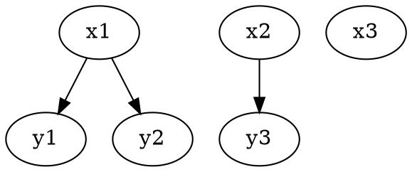
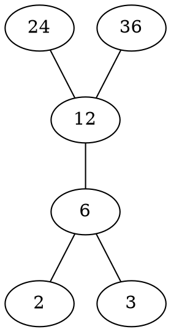

# 离散数学

## 一、数理逻辑

### 1. 命题逻辑

**命题**：能够确切判断结论真假的陈述句。

连结词与标识符：$\sim, \land, \vee, \to, \leftrightarrow, \triangledown, \uparrow, \downarrow$  
分别为非，合取，析取，如果...则，当且仅当，不可兼或，与非，或非  
最小功能完备集：$\{ \uparrow \}, \{ \downarrow \}, \{ \sim, \land \}, \{ \sim ,\vee \}$  
永真式：重言式 $T$；  矛盾式：$F$  

原子公式与否定为句节，有限个句节析取式称**子句**，其合取式为**合取范式**；有限句节合取式称**短语**，其析取式为**析取范式**。  

极大（小）项：包含每个命题变元成假（真）赋值的析（合）取范式  
> 如 $p q v$ 取0时命题为假（真），极大项为$p\vee q \vee r$，极小项为$\sim p \land \sim q \land \sim r$  

**主合（析）取范式**：找出使公式取值为0（1）的全部解释，其极大（小）项的合（析）取范式。每个命题唯一。  

**命题公式的等价**：对原子公式的任何赋值$A$与$B$的真值相同，记为$A \Leftrightarrow B$（当且仅当$A \leftrightarrow B$成立）
对偶公式：将$A$中的$\land\vee$互换，$T$换成$F$得到其对偶式  

#### 重要等价式

公式                                    |              名称
 :---------------------------:          |   :-------:
$P \to Q \Leftrightarrow \sim P \vee Q$ | 蕴含式
$P \land ( P \vee Q) \Leftrightarrow P$ $P \vee ( P \land Q) \Leftrightarrow P$ | 吸收律
$P \triangledown Q \Leftrightarrow ( \sim P \land Q) \vee (P \land \sim Q)$ | 排中律
$P \rightarrow Q \Leftrightarrow \sim Q \to \sim P$ | 逆反律

**命题公式的蕴含**：$A$取1时$B$也取1，则称$A$蕴含$B$，记为$A \Rightarrow B$。当且仅当$A \to B$成立时永真。  

#### **蕴含关系式**

公式                            |       名称
:-------------: | :----------------:
$\sim (P \to Q) \Rightarrow P / \sim Q$ | 简化法则（合取消去律）
$\sim P/Q \Rightarrow P \to Q $ | 扩充法则（析取引入律）
$P \land (P \to Q) \Rightarrow Q$ | 假言推理
$\sim Q \land (P \to Q) \Rightarrow \sim P$ | 拒取式
$\sim P \land (P \vee Q) \Rightarrow Q$ | 析取三段论
$(P \to Q) \land (Q \to R) \Rightarrow P \to R$ | 假言三段论
$(P \vee Q)\land (P \to R) \land (Q \to R) \Rightarrow R$ | 二难推论
$(P \vee Q) \land (\sim P \vee R) \Rightarrow Q \vee R$ | 归结原理

#### 命题逻辑推理

##### 规则

**P规则**：前提引用  
**T规则**：TE等价变换式，TI蕴含变换式  
**CP规则**：若推导结论形如$B \to C$，将$B$作为前提推出$C$  

##### 方法

1. 直接法  
2. CP规则法  
3. 反证法：将结论否定当作前提，最终推出F  

### 2. 谓词逻辑

谓词：描述客体变元关系的方法，也称命题函数。如$MAN(x,y,z)$。  

全称量词和存在量词：$\forall \ \ \ \exist$  
**原子构成：**  

1. 常量标识符：论域中确定的客体，如a，c，4  
2. 客体变元符：表示变量，x,y,x1,y2  
3. 函数标识符：小写字母或字母串f，g等  
4. 谓词标识符：大写字母或串，P，Q等  

谓词公式等价与蕴含都要求同一论域下  

#### 等价公式：

量词公式否定满足:  
$\sim (\forall x) P(x) \Leftrightarrow ( \exist x) [\sim P(x)]$  
$\sim (\exist x) P(x) \Leftrightarrow ( \forall x) [\sim P(x)]$  
量词辖域的收缩扩张：  
$Q \to (\forall x)/(\exist x) P(x) \Leftrightarrow (\forall x)/(\exist x) [Q \to P(x)]$  
$(\forall x)/(\exist x)P(x) \to  Q \Leftrightarrow (\exist x)/(\forall x) [P(x) \to Q]$  

$(\forall x) P(x) \land (\forall x) Q(x) \Leftrightarrow (\forall x) [P(x) \land Q(x)]$  
$(\forall x) P(x) \vee (\forall x) Q(x) \Leftrightarrow (\forall x)(\forall y) [P(x) \vee Q(y)]$  
$(\exist x) P(x) \land (\exist x) Q(x) \Leftrightarrow (\exist x)(\exist y) [P(x) \land Q(y)]$  
$(\exist x) P(x) \vee (\exist x) Q(x) \Leftrightarrow (\exist x) [P(x) \vee Q(y)]$  
$(\exist x) [P(x) \to Q(x)] \Leftrightarrow (\forall x) P(x) \to (\exist x) Q(x)$  

化为前束范式的步骤：  

1. 将$\to \ \ \leftrightarrow$用$\sim \land \vee$表示出来  
2. 将$\sim$ 深入否定到原子  
3. 使用换名或代入规则  
4. 利用等价关系将量词放到最左边  

>若$A=(Q_1x_1)(Q_2x_2)...(Q_ix_i)G$，则称$G$为$A$的母式。  
>将所有存在量词用常量标识符替换的前束合取范式称为**Skolem函数**。  

#### 蕴含公式：  

* $(\forall x) G(x) \Rightarrow G(y)/G(c)$ ：全称指定规则，US  
* $(\exist x) G(x) \Rightarrow G(c)$ ：存在指定规则，ES  
* $G(y) \Rightarrow ( \forall x)G(x)$ ：全称推广规则，UG  
* $G(c)/G(y) \Rightarrow (\exist x) G(x)$ ：存在推广规则，EG  
* $(\forall x)P(x) \vee (\forall x)Q(x) \Rightarrow (\forall x) [P(x) \vee Q(x)]$  
* $(\exist x) [P(x) \land Q(x)] \Rightarrow (\exist x)P(x) \land (\exist x) Q(x)$  
* $(\forall x) [P(x) \to Q(x)] \Rightarrow (\forall x)P(x) \to (\forall x)Q(x)$  
* $(\exist x) P(x) \to (\forall x)Q(x) \Rightarrow (\forall x) [P(x) \to Q(x)] $  
* $(\forall x) [P(x)\leftrightarrow Q(x)] \Rightarrow (\forall x) P(x) \leftrightarrow (\forall x)Q(x)$  

-------

$$(\forall x)(\forall y) P(x,y) \Rightarrow (\exist y)(\forall x) P(x,y)\Rightarrow (\forall x)(\exist y) P(x,y) \Rightarrow (\exist x)(\exist y) P(x,y) $$

#### 谓词逻辑推理方法：  

规则： P，T，CP，US，ES，UG，EG  

## 二、集合与关系  

### 1. 集合代数

表示方法：枚举法或代数法  
> 特征函数$\chi_A(x) =1$（当$x \in A$);$\chi_A(x) =0$（当$x \not\in A$)  

$\subseteq$:子集 $\subset $:真子集  
运算符：$\cup \cap - \bar{A} \oplus$：并，交，差，补，对称差  

**幂集**：$A$为一个集合，则$2^A$表示其幂集，包含$A$的全部子集  
**笛卡儿集**：$A_1,A_2...A_n$为n个集合，则$A_1 \times A_2 \times ... A_n = \{ (a_1,a_2,...,a_n)|a_i \in A_i \land  1\le i \le n\}$表示其幂集，包含$A$的全部子集  

>$A,B,C,D$为4个非空集合，则$A \times B \subseteq C \times D \Leftrightarrow A \subseteq C \land B \subseteq D $  

### 2. 二元关系

两个集合中的元素建立起的某种联系称为二元关系，如$A,B$为已知集合，二元关系$R$就是$A \times B$的一个合于$R= \{(x,y) \in A \times B |xRy\}$  

如$A=\{1,2\},B=\{2,3,4\} R=\{(1,2),(2,2),(2,4)\},\to 1R2,2R2,2R4;1\not R3$  

#### 表示方法

有向图表示法  

关系矩阵表示法：如果集合A下标i的元素和B下表j的元素建立起联系，则关系矩阵i行j列元素为1，其余为0  

>恒等关系：$I_A$，即自己与自身联系，形成自环  

#### 性质

1. 自反关系：$(\forall x \in A)xRx$  
2. 对称关系：$(\forall x,y \in A) [xRy \to yRy]$  
3. 可传递关系：$(\forall x,y,z \in A) [xRy \land yRz \to xRz] $  
4. 反自反关系：$(\forall x \in A) [(x,x)\notin R]$  
5. 反对称关系：$(\forall x,y \in A) [((x,y)\in R \land (y,x)\in R)\to x = y] $  

#### 运算

**复合关系**：$R \circ S =\{ (x,z) \in A \times C |(\exist y \in B) [(x,y) \in R \land (y,z) \in S] \}$  
> $R^2 = R \circ R, R^0=I_A, R^1=R, R^{-1}=\{(y,x) \in B\times A|(x,y) \in R\}$  

#### 闭包

闭包概念：R为A上的二元关系，R'包含R满足某种关系且最小。  

1. 自反闭包：$r(R)=R \cup I_A$  
2. 对称闭包：$s(R)=R\cup R^{-1}$  
3. 传递闭包：$t(R)=\cup^{\infty}_{i=1}R^i$  
    >$R^+=t(R)$（有限个R的次方并集），$R^* = I_A \cup t(R)$  
    >**Warshall算法**：用来计算$R^+$,若R关系矩阵M第i列中M[a,i]为1,则让a行元素与n行元素取或，并将结果传递给a行  

>$rs(R)=sr(R)$ ;$rt(R)=tr(R)$ ;$st(R) \subseteq ts(R)$  

### 3. 特殊关系

#### 等价关系

同时具有**自反，对称可传递**性质的二元关系  

等价类：$[a]_R=\{x|x\in A \land xRa\}$,a为这个等价类的代表元  
>若R是A上的等价关系,则任意$a,b\in A, [a]=[b] 或 [a]\land [b]  =\varnothing;  \cup_a [a] = A$  

分划： $\forall i \ne j,A_i \cap A_j = \varnothing; \cup_{i=1}^m A_m = A;S=\{A_1, A_2...,A-m\}$，则S为A上的一个分划。  
>A上每个等价关系都对应一个A的一个分划；二A的每个分划都能推出A上一个二元等价关系  

#### 偏序关系

同时具有**自反，反对称，可传递**性质的二元关系  
若偏序集中任意两个元素都可比较，则为**全序关系**  
有限元素的全序集称为**良序集**  

极大（小）元：不唯一；最大（小）元：唯一 ；长度：元素数目-1  

>$a | b$：b能被a整除  
>$a\preccurlyeq b$：a的ASCII码比b小或前面ASCII码相同的情况下a比b短  

表示方法：Hasse图

>24与6可比较，2与3不可比较  

拓扑排序：将偏序集顺序排列为全序集，不可比较的元素先后随意。  

### 4. 函数

也称映射，定义域（像源集）到值域（像集）的二元关系  

**单射**：$\forall t,s \in X,t \ne s\to f(t) \ne f(s)$  
**满射**：$(\forall y)(\exist x) f(x)=y$  
**双射**：既是单射又是满射  

复合函数：$f:X\to Y; g:Y\to Z; g\circ f:X \to Z$  

非空集合上双射称为**置换**，n个元素的集合上双射称n阶置换。  
>复合置换先右后左。如（1 2 4 3）（3 4 1）先看右边2不变，左边2变为4；则2变为4.最终结果为（2 4）  

逆函数：$g:Y\to X$ 存在条件：当且仅当f为双射  
>$(g\circ f)^{-1} = f^{-1}\circ g^{-1}$  

等势：能在集合间建立双射，是集合族上的等价关系，当且仅当$card(X)=card(Y)$（$card()$为集合基数即元素数目），记为~。  

有限集：存在自然数$m$使$X\thicksim N_m$，则X为有限集。  
无限集：当且仅当存在从N到X的单射。  
可数集：与N等势的集合。  
>$N\times N$是可数集  
>实数集R不是可数集  

## 三、图

### 1. 图的基本概念

#### 图

由二元组(V(G), E(G))组成的非空集合。V(G)为结点集，E(G)为边集。通常记为(n,m)称为n阶图。  
>广义图或伪图：允许环的出现。  

点度：与节点关联的边的数目（环算2条）入度为入边数目即指向u点边数；出度相反。  
>最大的点度记为$\Delta_G$，最小的点度为$\delta_G$  
>**握手定理**：$$\sum_{u\in V}d(u)=2m$$

**平凡图**：仅有一个孤立节点的图  
（k阶）**正则图**：各点度相等的图  
**完全图**：任意两节点相连的图，$K_n(n,(n(n-1)/2)$  
**有向完全图**：完全图每两个节点由双向的边  
**竞赛图**：每条边方向任意的完全图  

**二部图**：节点集X，Y使每一条边的一个节点在X中，另一个在Y中。如果X中每个节点都与Y的全部节点关联，称为完全二部图。  

**子图**：$G=(V_1,E_1),H=(V_2,E_2);V_2\subseteq V_1,E_2\subseteq E_1$；真子集则为**真子图**;  
当$V_2=V_1$，H为G的**生成子图**；  
当$V_2=V_1,E_2=E_1或E_2=\varnothing$,H为G的**平凡子图**

>删点子图，删边子图，点诱导子图，边诱导子图

补图，带权图

**同构**：$G=(V,E),G'=(V',E')$,如果存在$V$到$V'$的双射令二者的点边相对应，则称$G,G'$同构，记为$G\cong G'$  
>必要条件：点边数相同，度数相同的节点数相同

**道路**：一个节点v0到另一个节点vk经过的所有点和边的集合，边的数目k称为道路的长度。若P仅含一个节点称为零道路。若v0=vk，为开道路，否则为闭道路。  
若道路中边互不相同，称为**简单道路**，闭简单道路称为回路。  
若节点互不相同，称为**基本道路**。
**圈**：仅起点重点相同的道路，长度为奇数称为奇圈，否则为偶圈。  
>道路图：能被一条基本道路表示出来的图。
>若在n阶图中存在u到v的道路，则必存在一条u到v长度不超过n-1的道路

**连通图**：仅含1个支的图。图G支数记为$\omega(G) $  
（点）割集：连通图中去掉点集的点连通度大于1。仅含一个元素此点称为割点。  
边割集，割边。
>e是割边的充要条件是其不位于G的任何圈中

点（边）连通度：$\kappa(G) /\lambda(G)$使连通图产生非连通子图需要删除最少的点/边数。
>若$\kappa(G)/\lambda(G)\ge k$,称G为k（边）连通的
>$$\kappa(G) \le \lambda(G) \le \delta$$

**强连通图**：任意两点相互可达的简单有向图。  
>当且仅当其中含一条包含所有节点的有向闭道路。
>简单有向图中，位于且仅位于一个强分图中。
**单向连通图**：任意一对节点至少从一点到另一点可达。  
**弱连通图**：基图连通。
>图G的极大强连通子图称为**强分图**，极大单向连通图为**单向分图**，极大弱连通分图称**弱分图**。  

#### 图的矩阵表示法

1. 邻接矩阵
    有向（或无向）图中$V_i,V_j$相关联，则矩阵中点（i，j）为1，其余为0
    >$G=(V,E),A$为其邻接矩阵，$A^{k}=(a_{ij}^{(k)})_{n \times n}. a_{ij}^{(k)}$指$v_i$到$v_j$长度为$k$的道路数目

2. 可达性矩阵（道路矩阵）
    $V_i到V_j$存在道路，$p_{ij}$为1，否则为0  
    先构造$B_n=A+A^2+...+ A^n$,再构造$P$.  
    >相当于求A的传递闭包，可用Wallshell算法
    >>利用P求强分图： $P \odot P^T=(g_{ij})_{n \times n}$
    >>$$g_{ij}=\begin{cases} 1, & i=j\\ p_{ij}\land p_{ji}, & i\ne j \end{cases}$$
    >>一块1组成的矩阵即为一个强分图

3. 关联矩阵
    行表示点，列表示边，边为点出边则为1，入边为-1，其余为0。记为M。

### 2.树及其应用

#### 无向树及性质

定义：连通且不含圈的图称为**树**。
> 去掉上述连通条件的图称为**林**。

性质（以下命题等价）：

* 连通且无圈；  
* 无圈且m＝n-1；
* 连通且m＝n-1；
* 无圈，但在G中任何二结点之间增加一条新边后有且仅有一个圈；
* 连通的，但删除G中的任意一条边后，便不连通；(n>=2)
* 每一对结点之间有且仅有一条道路(n>=2)。
> 任意非平凡树至少有2个叶，阶大于2的树必有割点

**生成树**：某连通图G的生成子图T是树，则称为其生成树（需要包含原图所有定点）。

* 在T中的边称为树枝
* G中不再T中的边称为树补边
* G-T称为树补（边集）

>任何连通图必有生成树  
>G的任何边割集与T至少有一条公共边，G的任何圈与树补必有一条公共边

最小生成树**Kruskal算法**，在带权联通图G（V，E）中：

1. 选取G中权最小的边设为e1，S={e1}，i=1
2. 若i=n-1,输出边集G（S），结束
3. 选E-S中不与当前边集构成圈的最小边加入S，转2

#### 根树

有向图G的基图是树，G为**有向树**。方向全出称为*外向树*（常见树），全进称为*内向树*。
根，叶，分枝点。
层次/距离：节点到跟的距离。  
高：所有节点最大层次。

若外向树中任何节点最多出度为m，称为**m叉树**。全部分枝点出度均为m称为**完全m叉树**。若完全数全部叶节点位于统一层次，称为**正则m叉树**。
> 若T为完全m叉树，其叶数位t，支节点数位i，则$(m-1)i=t-1$

有序树或林转化为二叉树：

1. 从根开始，保留每个父亲同其最左边儿子的连线，撤销与别的儿子的连线。
2. 兄弟间用从左向右的有向边连接。
3. 按如下方法确定二叉树中结点的左儿子和右儿子：直接位于给定结点下面的结点，作为左儿子，对于同一水平线上与给定结点右邻的结点，作为右儿子，依此类推。

**最优二叉树**：叶权与道路长度乘积之和最小的树。
算法：**Huffman算法**：

1. 连接权为w1,w2的两片树叶，得一个分支点，其权为w1+w2；
2. 在w1+w2，w3, …,wt中选出两个最小的权，连接它们对应的顶点（不一定是树叶），得新分枝点及所带的权；
3. 重复2，直到形成t－1个分支点，t片树叶为止。

### 3. 平面图及其应用

#### 基本概念

图G=（V，E）的每条边没有在公共节点外相交称G为**平面图**。  
G中每个最小封闭区域称为**面**，面边界的变数称为**度**（割边计算时算两条边）。  
> 平面图G中所有面的面度之和为边数2倍。
>G为平面图，则其子图均为平面图；G为非平面图，则其母图均为非平面图。

* $K_n(n\ge 5)和K_{3,n}(n \ge 3)$为非平面图。

#### 欧拉公式

* 若G为面数为f的（n,m)连通平面图，则：$$n-m+f =2$$

>对于具有k（k>=2)个连通分支的平面图,有$n-m+f=k+1$

* G是阶大于2的连通简单平面图，则$$m \le 3n-6$$

>任何简单连通图中，至少存在1个度不超过5的节点

* G是围长(指包含最短圈的长度，不含圈则为无穷大）g大于2的连通平面图，则$$m\le \frac{gn-2g}{g-2}$$

#### 平面图的判断

细分：在图G的边uv上新增加一个二度结点，称为图G的细分。一条边上也可以同时增加有限个二度结点，所得的新图称为原来图的细分图。

**Kuratowski定理**：一个图是平面图的充分必要条件是它不包含与K5或K3,3细分图同构的子图。

#### 对偶图

平面图G=(V,E)**对偶图**G*构造如下：

1. G中的面F与V*的点u一一对应
2. 如Fi与Fj邻接，则ui与uj邻接
3. 如G中一条边e只是Fi的边界，则ui有一环

G*与G的关系如下：
n*=f,m*=m,f*=n

>若G\*为G对偶图，$G^*\cong G$,称G为自对偶图

#### 平面的点图着色

将G相邻定点涂不同颜色称为*着色*，若图顶点最少k种颜色称为**k色图**，其**色数**为k，可记为$\chi(G)$。
> 仅当G为0图时其色数为1，$\chi(K_n)=n$。
>设G中至少含一条边，则$\chi{G}$=2当且仅当G为二部图。
>对于任意的图G(不含环)，均有$\chi(G)\le \Delta(G)+1$

同样可定义**面着色**和**面色数**，记为$\chi^*(G)$
>G时k面可着色的，当且仅当其对偶图时k可着色的
>任何连通平面图都是可以5着色的