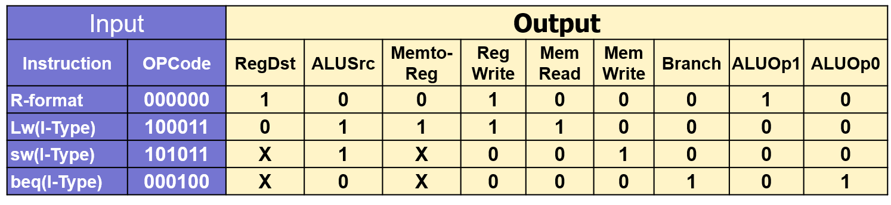
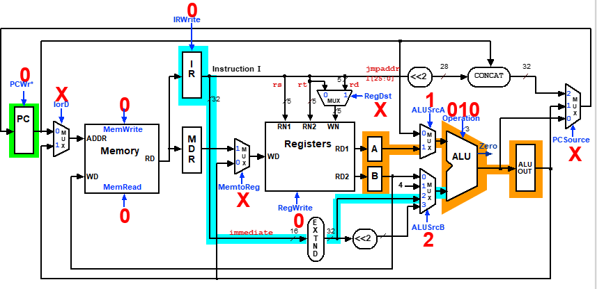
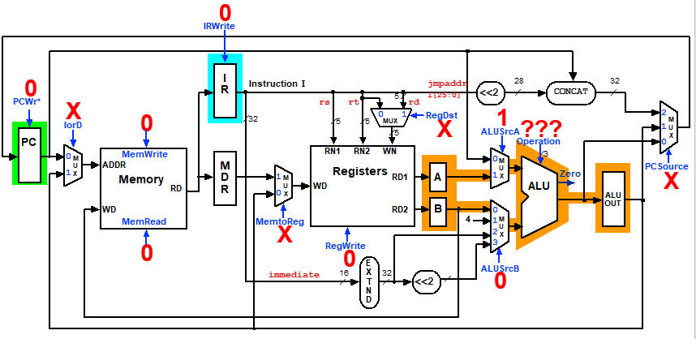
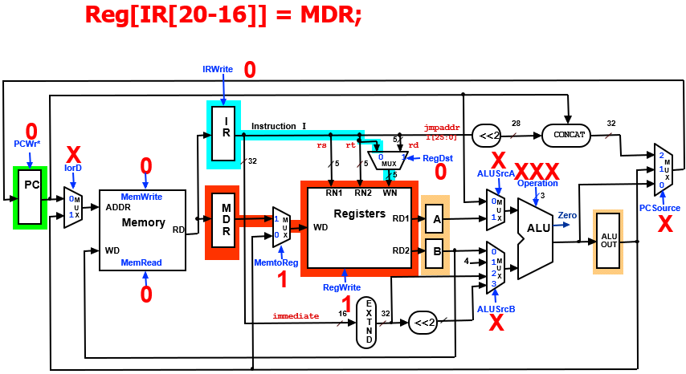
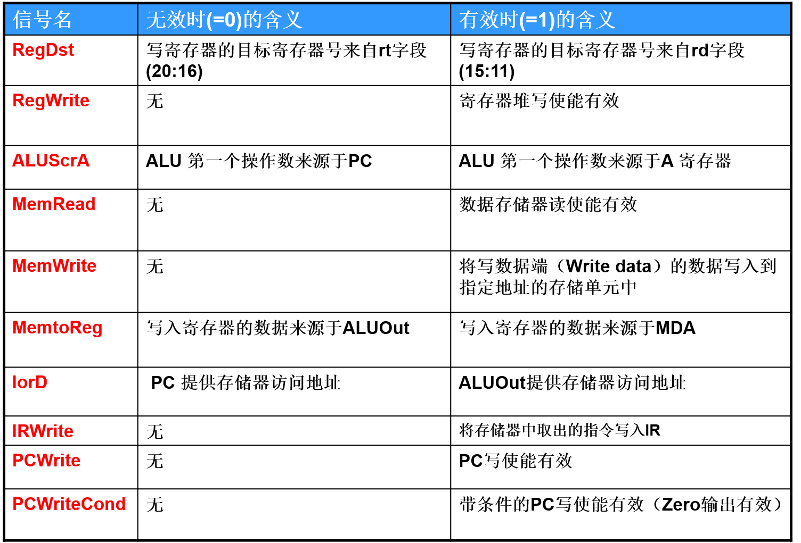

# 计算机组成原理

## 一、计算机概要与技术

### 1.1 引言

分类：个人计算机，服务器，嵌入式计算机,个人移动设备（PMD），云计算  

$$KB =10^3,KiB=2^{10} ;MB =10^6,MiB=2^{20}$$

1字节（Byte）= 8位 (Bit), 1字通常为4字节

### 1.2 计算机系统结构中8个伟大思想

1. 面向摩尔定律的设计
2. 使用抽象简化设计
3. 加速大概率事件
4. 通过并行提高性能
5. 通过流水线提高性能
6. 通过预测提高性能
7. 存储器层次
8. 通过冗余提高可靠性

### 1.3 程序设计入门

层次结构：硬件>系统软件>应用软件
高级语言--编译--：汇编语言--汇编--：机器语言

### 1.4 硬件概念入门

五大部分：

* 输入设备：为计算机提供信息的装置
* 输出设备：将计算结果输出给用户或其它计算机的装置
* 数据通路：在处理器中执行算术操作的部分
* 控制器：处理器中根据程序中的指令指挥数据通路、存储器和I/O设备工作的部分
* 存储器（内存）：程序运行时的存储空间，同时还存储程序运行时所需的数据。

>数据通路和控制器合称“中央处理单元”（CPU）;存储器、数据通路和控制器在信息处理操作中起主要作用，是计算机硬件的主体部分，通常被称为“主机”。

显示器
>CRT显示：阴极管电子轰击，位图显示  
>LCD显示：液晶显示，轻巧低功耗

存储设备：
高速缓存 — 主存储器 — 二级存储器

1. **主存储器**：程序运行时的存储空间，也存放需要处理的数据。也称为内存，由DRAM（动态随机访问存储器）芯片组成。  
2. **高速缓存**：作为DRAM的缓冲，解决CPU和主存之间的速度匹配。由SRAM（静态随机访问存储器）芯片组成，比DRAM 更快，集成度更低。
3. **二级存储器**：非易失性存储器
    * 磁盘
    * 闪存：PMD的二级存储器的标准

### 1.5 性能

#### 性能的定义：

* 响应时间：也叫执行时间，是计算机完成某任务所需要的总时间，包括硬盘访问、内存访问、I/O活动、操作系统开销和CPU执行时间等。PC用户感兴趣
* 吞吐率：也叫带宽（bandwidth），表示单位时间内完成的任务数量，数据中心感兴趣。

#### 性能的度量：

1. 时钟周期：CPU主频的倒数
2. CPU（执行）时间：某一任务在CPU上花费的时间；=用户CPU时间+系统CPU时间

#### CPU性能

一个程序的 CPU执行时间 = 一个程序的CPU时钟周期数/时钟频率

#### 指令性能

一个程序的CPU时钟周期数 = 程序的指令数×每条指令的平均时钟周期数
>CPI：每条指令的平均周期数，表示执行某个程序或程序片断时每条指令所需的时钟周期平均数。

#### 经典CPU性能公式

$$T_{CPU} = 指令数 \times CPI \times 时钟周期时间，（T_{CPU}为CPU时间）$$

## 二、计算机的语言

计算机中信息分为：数据信息（数值与非数值）和控制信息

### 2.1 数据信息表示方法

#### 2.1.1 进制及转换

r进制：$\sum X_i \times r^i$
十进制化为二进制：除2取余，直到被除数为0。余数倒过来
小数：乘2取整，直到小数部分为0

#### 2.1.2 机器数编码

原码：最高位为符号位，其余正常
补码：符号位可参与计算，负数补码为原码除符号位部分取反+1
>符号扩展：补码可将其符号位向前复制多次填满高位
反码：负数除原码符号位取反

#### 2.1.3 数据表示方法

1. 定点表示法
    小数点位置隐含约定，固定不变
2. 浮点表示法
    $$N=(-1)^S \times F \times 2^E$$
    如$(-1)^0\times 0.011011_2 \times 2^{011}$
    S为符号位；E为N的指数,或称为阶码；F为N的尾数，代表全部有效数值，在0-1之间

    1. MIPS中浮点表示如下：
        * 单精度：

            可表示从$2.0\times 10^{-38} - 2.0\times 10^{38}$的数值

        S       |   E   |   F
        :-----: | :----:|:----:
        31(1位) |30-23(8位)|22-0(23位)

        * 双精度：

            可表示从$2.0\times 10^{-308} - 2.0\times 10^{308}$的数值

        S       |   E   |   F
        :-----: | :----:|:----:
        31(1位) |30-20(11位)|19-0

        F |
        :-----:|
        31-0(52位）|

        >科学记数法
        >其中指数均用移码表示，及补码符号位取反 $[E]_移 = E+Bias$;E为指数的真值，Bias 为偏阶，通常 $Bias= 2^n$ ，其中，n为指数的数码位位数， $2^n$ 是符号位的位权。

    2. IEEE 754浮点标准：
        $$N=(-1)^S\times (1+Fraction) \times 2^{Exponent-Bias}$$
        其中单精度的Bias为127$(2^8-1)$,双精度为1023$(2^11-1)$
        Fraction只是尾数域的值，其值在0和1之间，真正有效位的值为： 1+Fraction。（隐含尾数域前有一定点）
        Exponent是指数域的值，Exponent-Bias指明该数的小数点位置，表示数据的大小范围。
        MIPS中的表示与之前相同，只是E换成了Exponent，为无符号数，值为指数+Bias；F换成了Fraction，为小数部分-1

#### 2.1.4 字符表示方法

1. ASCII码：“美国标准信息交换代码”(American Standard Code for Information Interchange)，简称ASCII码。使用8位的字节来表示字符。
2. Unicode编码：是大多数人类语言中字母的通用编码。通常采用16位来表示一个字符。

### 2.2 MIPS指令集

#### 2.2.1 基本概念

指令集：一个给定的计算机体系结构所包含的指令集合。

存储程序：多种类型的指令和数据均以数字形式存储于存储器中。

#### 2.2.2 MIPS的操作数

1. 规定：
    算术指令操作数必须来自寄存器
    * 寄存器大小：32位（1个字）
    * 寄存器个数：32个
    寄存器表示：

    名称     |寄存器号    |用途   |调用时是否保存
    :----:   | :----:    |:----: |:-----:
    $zero    | 0         |常数0  | 不适用
    \$v0~$v1 | 2~3       |计算结果|否
    \$a0~$a3 | 4~7       | 参数  | 否
    \$t0~$t7 | 8~15      | 临时变量|否
    \$s0~$s7 | 16~23     |保存的寄存器| 是
    \$t8~$t9 | 24~25     | 更多临时变量| 否
    $gp      | 28        | 全局指针 |是
    $sp      | 29        | 栈指针  | 是
    $fp      | 30        | 帧指针  | 是
    $ra      | 31        | 返回地址| 是

2. 存储器操作数

    用于存放复杂的数据类型
    编址方法：1个字4个字节，1个字节8位
    lw：取字（load word）

        lw $s1,20(\$s2):\$s1=Memory[\$s2 + 20]

    sw：存字（store word）

        sw  $s1,20(\$s2): Memory[\$s2 + 20]=\$s1

#### 2.2.3 MIPS指令表示

##### MIPS指令类型：

类型    | 6bits  | 5bits  | 5bits  | 5bits  | 5bits | 6bits
:----: | :----: | :----: | :----: | :----: | :----: | :----:
R型 | op | rs | rt  | rd | shamt | funct  
I型 | op | rs | rt  | constant or address  
J型 | op | target address

R型：寄存器类型；I型：立即数类型；J型：跳转指令类型

* op：基本操作操作码  
* rs：第一个源操作数寄存器  
* rt：第二个源操作数寄存器  
* rd：存放操作结果的目的寄存器
* shamt：位移量
* funct：功能

常用指令字段值：

指令 | 格式 | op | rs | rt | rd | shamt | funct | address
:--:|:--:|:--:| :--: | :--:|:--:|:--:|:--:|:--:
add |R|0|reg|reg|reg|0|32|n.a.
sub |R|0|reg|reg|reg|0|34|n.a.
addi |I|8|reg|reg|常数|n.a.|n.a.|n.a.
lw |I|35|reg|reg|n.a.|n.a.|n.a.|address(常数)
sw |I|43|reg|reg|n.a.|n.a.|n.a.|address(常数)

#### 2.2.4 逻辑操作

##### 1. 移位（shift）

对应rd,rt,shamt

1. sll：左移i位，相当于乘2^i，补充0  

        sll $t2,$s0,4
2. srl：右移i位，相当于除以2^i，补充0  

        srl $t2,$s0,4  

##### 2. 按位与，或，取反（AND，OR，NOT）

    and $t0, $t1, $t2
    or $t0, $t1, $t2
    not $t0, $t1, $t2       #t1或t2再取反

##### 3. 立即数与，或（andi，ori）

    andi $s1,$s2,10
    ori $s1,$s2,10

#### 2.2.5 决策指令

* 分支指令：类似于goto指令，跳转到L1标签处

        beq  register1, register2, L1     #相等则分支
        bne  register1, register2, L1     #不相等则分支

* 置位指令：

        slt   $t0, $s3, $s4        # 小于则置位$t0=1 if $s3 < $s4
        slti   $t0, $s2, 10        # 立即数版 $t0=1 if $s2 < 10
        sltu   $t0, $s3, $s4       # 无符号整数版 $t0=1 if $s3 < $s4
* 跳转指令：

        jr  $ra     #return R型
        j   L       #跳转到语句

#### 2.2.6 计算机硬件对过程的支持

* 过程：根据提供的参数执行一定任务的存储的子程序。

    >通过参数传递数值并返回结果。有助于提高程序的可理解性和代码的可重用性。
* MIPS过程调用时寄存器约定：
    >\$a0~$a3：用于传递参数的参数寄存器
    >\$v0~$v1：用于返回值的值寄存器
    >\$ra：用于返回起始点的返回地址寄存器
* 过程调用指令：
    程序计数器（PC）：保存当前运行的指令的地址
    调用者：跳转和链接指令[J型]

        jal   ProcedureAddress
    被调用者：寄存器跳转[R型]

        jr   $ra
* 栈：
    压栈push，出栈pop
    栈指针：$sp

    \$t0~\$t9：不必保存  
    \$s0~\$s7：必须被保存

>如实现C过程:
>```C
>int leaf (int g,int h,int i,int j)
>{
>   int f;
>   f = (g + h) - (i + j);
>   return f;
>}
>```
>参数变量g，h，i和j对应参数寄存器\$a0-a3,f则对应\$s0.MIPS代码如下
>
>       addi $sp, $sp, -12  #留出3个栈指针的位置
>       sw $t1, 8($sp)      #自上而下保留$t1，$t0，$s0的值
>       sw $t0, 4($sp)
>       sw $s0, 0($sp)
>
>       add $t0, $a0, $a1      # register $t0 contains g + h
>       add $t1, $a2, $a3      # register $t1 contains i + j
>       sub $s0, $t0, $t1       #f = $t0- $t1, which is (g + h)– (i + j)
>       add $v0, $s0, $zero  # returns  f ( $v0 = $s0 + 0)
>
>       lw $s0, 0($sp)     # restore register $s0 for caller
>       lw $t0, 4($sp)     # restore register $t0 for caller
>       lw $t1, 8($sp)     # restore register $t1 for caller
>       addi $sp, $sp, 12    # adjust stack to delete 3 items
>       jr  $ra          # jump back to calling routine

* 嵌套过程:

如

```c
int fact(int n)
{
    if(n < 1) return 1;
    else return(n* fact(n-1));
}
```

则MIPS代码为:

    fact: addi    $sp, $sp, -8                      # adjust stack for 2 items
        sw     $ra, 4($sp)            # save the return address
        sw     $a0, 0($sp)        # save the argument  n
        slti   $t0, $a0, 1             # test for  n  <  1
        beq   $t0, $zero, L1        # if  n  >=  1, go to L1(else)
        addi    $v0, $zero, 1     # return if n <1
        addi    $sp, $sp, 8     # Recover $sp (Why not recover $ra and $a0 ?)
        jr       $ra                     # return to after jal

    L1:  addi   $a0, $a0, -1       # n  >=  1: argument gets ( n  -  1 )
        jal    fact                # call fact with ( n  -  1 )
        lw    $a0, 0($sp)            # return from jal: restore argument n
        lw    $ra, 4($sp)            # restore the return address
        addi   $sp, $sp, 8           # adjust stack pointer to pop 2 items
        mul   $v0, $a0, $v0            # return  n*fact ( n  -  1 )
        jr   $ra                       # return to the  caller

#### 2.2.7 32位立即数和寻址

1. 32位立即数:
    读取立即数指令:
    * lui(load upper immediate)将立即数设置为寄存器的高16为位，其低16位自动补0

            lui  $t0,255
    * ori插入低16位立即数

            ori $s0, $s0, 2304

2. 分支和跳转中寻址

    * 跳转指令：j型

            j 10000 #go to location 10000
        直接寻址：26位地址左移两位后拼接PC中高4位

    * 分支指令： beq，bne I型

            bne &s0, $s1, Exit
        PC相对寻址：PC = (PC + 4) +Branch address(16位地址左移2位形成的18位分支地址)

3. 寻址模式总结：

    1. 立即数寻址：操作数位指令中常数
    2. 寄存器寻址：操作数是寄存器
    3. 基址寻址：操作数在内存中，地址是指令中基址寄存器和常数的和
    4. PC相对寻址：地址是PC和指令中常数的和
    5. 伪直接寻址：地址有指令中26位字段和PC高位连接而成

#### 2.2.8 翻译并执行程序

##### 翻译层次：

    C语言程序 ——（编译器）——汇编语言程序——（汇编器）——目标模块：机器语言模块（+目标库：例程序（机器语言））——（链接器）——可执行代码：机器语言程序——（加载器）——存储器

##### 编译器

C程序->汇编语言程序

##### 汇编器

汇编语言程序->目标文件（机器语言指令）
伪指令：汇编语言指令的一个变种，通常被看作一条汇编指令。

        如move $t0, $t1 #伪指令 -> add $t0,$zero,$t1 #机器语言指令

目标文件包括机器语言指令、数据和指令正确放入内存所需要的信息。

* UNIX目标文件：

    1. 目标文件头，描述目标文件中相关部分的大小和位置。
    2. 代码段
    3. 静态数据段
    4. 重定位信息
    5. 符号表
    6. 调试信息

##### 链接器

将独立的汇编程序拼接起来
目标模块（包括目标库）-> 可执行文件（机器语言程序）

链接工作分为3部分：

* 将代码和数据模块象征性地放入内存
* 决定数据和指令标签的地址
* 修补内部和外部引用

##### 加载器

把目标程序装载到内存中以准备运行。

工作步骤：

* 读取可执行文件头来确定代码段和数据段的大小
* 为正文和数据创建一个足够大的地址空间
* 将可执行文件中的指令和数据复制到内存中
* 把主程序的参数（如果存在）复制到栈顶
* 初始化机器寄存器，将栈指针指向第一个空位置
* 跳转到启动例程，它将参数复制到参数寄存器并且调用程序的main函数。当main函数返回时，启动例程通过系统调用exit终止程序。

## 三、计算机的算术运算

### 3.1 定点加减运算

#### 补码加减：

1. 符号位直接参与运算
2. 若操作码为减，减数取反补码后再与被减数相加

#### 溢出：

运算结果超出机器表示的最大正数或最小负数

* 正溢：两正数相加超过范围
* 负溢：两负数相加超过范围

判别方法1：仅同号相加才会溢出，标志为结果符号与操作数符号相反  

判别方法2：操作数采用双符号为，通过运算结果符号位判断：

* 00-结果为正，无溢出
* 01-结果正溢
* 10-结果负溢
* 11-结果为负，无溢出

溢出处理：

* ALU（算术逻辑单元）的硬件进行溢出检测
* 产生一个异常（中断）
* 将产生溢出的指令地址保存到异常程序计数器（EPC）中
* 跳到预先设定好的地址执行异常处理程序

溢出产生：仅在有符号算术指令溢出时才会产生异常

* 无符号：addu，subu，addiu
* 取无符号字节：lbu，将一个字节装入低8位，空位补0；有符号：lb，空余位补符号位

### 3.2 算术逻辑运算部件

算术和逻辑运算都可用ALU（算术逻辑运算单元）实现。

#### 一位加法器（全加器）

a，b：本位操作数；C1：低位仅为；C0：本位进位；Sum：本为和


$$Sum = a\oplus b \oplus C_1; C_0 = bC_1 +aC_1+ab$$

#### 一位ALU

A AND B 和A OR B输入哪个根据操作信号判断，可实现A ADD B


* 扩展：再加一个判断B是否取反的信号，可实现A SUB B


* 扩展2：实现b-a，实现小于则置位（slt)，实现溢出检测


#### 32位ALU


* 并行加法器
* 输入：A，B
* 输出：result，overflow
* 控制线：Ainvert，Bnegate（Binvert，CarryIn），Operation
* 输入并行，进位信号串行传递
* 0检测器

#### ALU符号与功能


ALU控制表：

ALU 控制线(Ainvert Bnegate Operation) | 功能
:---: | :----:
0000 | 与
0001 | 或
0010 | 加
0110 | 减
0111 |小于置位
1100 | 或非

### 3.3 乘法运算

1. 算法及硬件

    （改进版本：相加后的部分乘积右移一位代替被乘数左移一位，乘数每次检测最低位

    

    

    64位积寄存器低32位存放乘数（第二个操作数），右移出的一位作为信号判断被乘数是否执行加法操作

2. 有符号乘法

    基本思想：将被乘数和乘数转化为正数，符号位不参与运算。当符号相异时，最后乘积为负。

3. MIPS中的乘法

    * 两个32位寄存器存放64位的乘积：Hi，Lo
    * 乘法：mult $S2, $S3
    * 无符号乘法：multu $S2, $S3
    * 从Lo寄存器取数：mflo $S1 （move from lo)
    * 从Hi寄存器取数：mfhi $S1

### 3.4 除法运算

基本思想：余数-除数=新余数（循环）

1. 算法及硬件

    （改进版本：商寄存器和余数寄存器的右半部分进行拼接，余数和商一起左移

    

    

    64位余数寄存器高32位存放余数，低32位存放商。高位减除数后左移（均为补码），若高位（即余数）<0，则恢复余数。否则保留余数，下次左移时商值补1。

2. 有符号除法

    * 取绝对值相除
    * 符号单独处理，异号相除为负
    * 余数符号与被除数相同

3. MIPS中的除法

    * 两个32位寄存器：Hi 存放余数，Lo 存放商
    * 除法：div  $S2, $S3
    * 无符号除法：divu  $S2, $S3

### 3.5 浮点运算

IEEE754标准下

* 溢出：
    溢出（上溢）：正的指数太大而导致指数域放不下的情况。
    下溢：负的指数太大而导致指数域放不下的情况。

* 舍入（Round）：
    IEEE754中，在浮点中间计算中，右边总是多保留两位，分别称为保护位和舍入位，用于进行舍入操作。  
    粘贴位：同保护位和舍入位一样用于舍入的位，当舍入位右边有非零的数据时将其置为1。
    四种舍入格式：向上，向下，截断，最近舍入（对于中间值判断粘贴位决定取舍）

#### 浮点加法

* 运算步骤

    1. 对阶：使两数阶码（指数）相等，小阶向大阶对齐。
    2. 尾数相加
    3. 结果规格化，检查是否溢出

* 硬件结构

    

#### 浮点乘法

* 运算步骤

    1. 指数相加
        若指数不带偏阶，按补码加法进行指数相加。
        若指数带偏阶，相加后结果减去一个偏阶
    2. 有效数相乘
    3. 结果规格化，判断有无溢出
    4. 进行舍入
    5. 确定符号位值

#### MIPS浮点指令

* 硬件

    1. 增加了单独的浮点寄存器:
        存放32位单精度浮点数: \$f0, \$f1, … \$f31  
        存放双精度浮点数: \$f0/\$f1, \$f2/\$f3  
    2. 浮点寄存器存取指令：
        lwc1, ldc1, swc1, sdc1  
        e.g., ldc1 \$f8, 32(\$sp)  
* 浮点指令

    1. 单精度运算
        add.s, sub.s, mul.s, div.s  
        e.g.add.s \$f0, \$f1, \$f6  
    2. 双精度运算  
        add.d, sub.d, mul.d, div.d  
        e.g.mul.d \$f4, \$f4, \$f6  
    3. 单双精度比较
        c.x.s，c.x.d  
        其中x可以是等于 （eq）、不等于（neq）、小于（lt）、小于等于（le）、大于（gt）或大于等于（ge））  
        根据比较结果设置cond=1或cond=0
        e.g. c.lt.s  \$f3, \$f4
    4. 条件分支（根据cond值）
        bc1t（ cond=1时跳转）  bc1f（ cond=0时跳转）  
        e.g. bc1t TargetLabel

## 四、处理器

* CPU的基本功能：自动地连续地取出指令，解释指令，执行指令
    1. 程序控制：保证机器按顺序执行程序时CPU的首要任务
    2. 操作控制：一条指令的功能往往是由若干个操作信号的组合来实现的。
    3. 时间控制
    4. 数据加工

* 基本的MIPS实现（即MIPS指令集的核心子集）：

    1. 存储器访问指令：lw,sw
    2. 算术逻辑指令：add,sub,and,or,slt
    3. 分支指令：beq,j

    

### 4.1 逻辑设计的一般方法

#### 主要的逻辑单元

1. 组合单元：一个操作单元，如与门或ALU。
    * 处理数据值
    * 输出是输入的函数
2. 状态单元：一个存储单元，如寄存器存储器
    * 存放信息
    * 至少2个输入(吸入的数据值和决定何时写入的时钟信号)

#### 时序系统

1. 时序发生器：产生时钟周期节拍、脉冲等时序信号的部件。
    一个脉冲源：又称主振荡器，提供CPU的时钟基准
    一组计数分频逻辑：主振的输出经过一系列计数分频，产生时钟周期（节拍）信号。
2. 时钟：一个具有固定周期时间的不停运转的信号。
3. 时钟同步方法：一种根据时钟来决定数据何时有效和稳定的方法。
4. 边沿触发时钟：一种时钟机制，在这种机制下所有的状态改变都发生在时钟边沿。

### 4.2 建立数据通路

1. 数据通路部件
    用来操作或保存处理器中数据的单元。包括：
    * 指令存储器
    * 数据存储器
    * 寄存器堆
    * ALU
    * 加法器
    程序计数器（PC）：存放将要被执行指令地址的寄存器

2. MIPS指令实现过程
    1. 取指：
        * 从指令存储器中取出一条指令
        * 修改PC使其指向下一条指令
    2. 指令译码&读操作数：
        * 将指令转换成一组机器控制命令
        * 读寄存器中的操作数
    3. 执行：
        * 控制ALU实现相应操作
    4. 存储器访问：
        * 从存储器中读写数据
        * 只适用于lw/sw型指令
    5. 写结果到寄存器：
        * R型指令：写结果到rd
        * I型指令：结果写到rt

### 4.3 简单的数据通路（单周期）
    


1. 各控制信号的作用：

    控制信号名  |   无效时（=0）含义 | 有效时（=1）含义
    :---: | :---: | :---:
    RegDst | 写寄存器的目标寄存器号来自rt字段(20:16) | 写寄存器的目标寄存器号来自rd字段(15:11)
    RegWrite | 无   |  寄存器堆写有效
    ALUSrc  | 第二个ALU操作数来自寄存器堆第二个输出（读数据二） | 第二个ALU操作数位指令低16位的符号扩展
    PCSrc（Branch） | PC由PC + 4取代 | PC由分支目标地址取代
    MemRead | 无 | 数据存储器读使能有效
    MemWrite | 无 | 将写入数据的输入端的数据写入到用地址指定存储器单元中取
    MemtoReg | 写入寄存器的数据来自ALU | 写入寄存器的数据来自数据存储器
    ALUOp：ALU的控制位，共两位。 用于与R型指令的funct字段一起译码形成4位ALU控制信号。

    * 两级译码：op[31-26]对应主控制单元；funct[5-0]对应ALU控制单元
    
2. ALU控制：

    ALU 控制线(Ainvert Bnegate Operation) | 功能
    :---: | :----:
    0000 | 与
    0001 | 或
    0010 | 加
    0110 | 减
    0111 |小于置位
    1100 | 或非

    Load/Store指令: 使用加法计算地址
    相等则分支指令: 使用减法判断是否相等
    R型指令: 依赖funct 字段执行前5种操作中的一种

    ALU 控制信号的形成：

    

3. 主控单元的设计
    1. 基本控制原理
        32位指令是相关控制信息的产生依据
        其中操作码确定相关操作（如：算术逻辑运算、读/写等）
        通过主控制单元发出各种控制信号来控制数据的传送 （如控制多选器的输入）
        指令类型和function字段共同决定ALU的操作
    2. 各类指令在数据通路中的操作

        
        
        
        
        

    3. 形成控制单元的输入输出表

        

    4. 单周期特点
        * 一个时钟周期执行一条指令的实现机制
            每一条指令从一个时钟周期的上升沿（或下降沿）开始，在下一个时钟周期的上升沿（或下降沿）结束。
        * 简单，容易理解
        * 太慢不实用，效率低：
            时钟周期要由执行时间最长的那条指令决定

### 4.4 多周期实现机制

1. 多周期实现：
    * 将一条指令的执行过程划分成多个阶段，每个阶段占用一个时钟周期
        * 每个阶段的工作量尽量均等
        * 每个周期只使用一个主功能单元
    * 在每个周期末尾：
        * 增加额外的内部寄存器
        * 暂存后续周期会使用的数据
    * 不同类型的指令占用不同的时钟周期数

2. 多周期的数据通路：

    

    将指令存储器和数据存储器合为一个存储器  
    将ALU和两个加法器合为一个ALU  
    在每个功能单元后都增加相应的寄存器用于暂存该单元的输出结果直到在下一个周期将其内容送往下一个功能单元。  
    * 指令寄存器（IR）：从内存中取出的指令放到IR中
    * 数据缓冲寄存器（MDR）：从内存中取出的数据放到MDR中
    * A、B寄存器：从寄存器rs 和 rt 中读出的操作数存放到A和B 两个寄存器中
    * ALUOut：存放ALU 的运算结果

3. MIPS指令执行过程
    * IF：取指
        * 根据PC从存储器中取出一条指令并送到指令寄存器（IR）中。
            `IR = Memory[PC];`
        * 将PC的内容加4并写到PC中。
            `PC = PC + 4;`
        
    * ID：译码和读寄存器
        * 读寄存器rs和rt中的操作数（无论以后是否会使用）。
        * 若是分支指令，则计算分支目标地址。
            `A = Reg[IR[25-21]]; B = Reg[IR[20-16]]; ALUOut =PC+(sign-extend(IR[15-0]) << 2);`
        

    * EX（BC）：执行/地址计算（分支完成）
        根据指令类型的不同，执行不同操作：
        * 访存指令( lw / sw ):
            `ALUOut = A + sign-extend(IR[15-0]);`
            
        * R型指令:
            `ALUOut = A op B;`
            
        * 条件分支:
            `if (A==B) PC = ALUOut;`
            
        * 跳转指令:
            `PC = {PC[31-28],(IR[25-0] << 2)};`
            

    * MEM（WB）：存储器访问（R型指令写回）
        根据指令类型的不同，执行不同操作：
        * Load/stores指令：
            `MDR = Memory[ALUOut]; # for lw`
             
            `Memory[ALUOut] = B;   # for sw`
             
        * R型指令完成：
            `Reg[rd] = Reg[IR[15-11]] = ALUOut;`
             

    * WB：写回
        写结果到寄存器
        * Load指令
            `Reg[rt]=Reg[IR[20-16]]= MDR;`
            
        (每一条指令通常3-5个时钟周期)

4. 多周期CPU的CPI
    CPI：每条指令的平均周期数，表示执行某个程序或程序片断时每条指令所需的时钟周期平均数。
    CPI = CPU 总周期数/ 指令总条数

5. 最终完善

    

    各控制信号的功能:

    
    

6. 控制实现

    不同控制信号值的产生依赖于：
    * 被执行的指令类型
    * 指令执行到了哪个阶段

    实现方法：有限状态机——组合逻辑控制器

    

7. 与单周期相比多周期实现的优势

    * 资源共享。对于单个指令来说，可以在不同周期中使用同一功能单元。
    * 执行通路较短的指令占用的周期数较少，其执行完成所需时间也较短。

## 五、存储器层次结构

### 5.1 引言

* 两大功能：存储，取出  
* 性能指标：容量，速度，价格  
* 分类： 内存，外存（二级存储器），高速缓存
* 提高性能思路：利用局部性原理构建存储器层次结构

    局部性原理：
    1. 时间局部性：如果某个数据项被访问，那么在不久的将来它可能再次被访问。
    2. 空间局部性：如果某个数据项被访问，与它地址相邻的数据项可能很快也被访问。

    存储器层次结构：
    一种由多存储器层次组成的结构，存储器容量和访问时间随着离处理器距离的增加而增加。
* 三级存储体系结构：
    1. 内存-外存层次
        目的：增大容量
        构成虚拟存储器
    2. Cache-内存层次
        目的：提高速度
        构成主存储器

* 命中率：在高层存储器中找到目标数据的存储访问比例。
* 缺失率（失效率）：在高层存储器中没有找到目标数据的存储访问比例。
* 命中时间：访问高层存储器所需要的时间，包括判断是否命中所需时间。
* 缺失代价（开销）：将相应的块从低层存储器替换到高层存储器所需的时间。
* 平均访存时间（AMAT）
   AMAT=命中时间+缺失率 x 缺失代价

### 5.2 存储器技术

1. SRAM（Static RAM）技术
    利用双稳态触发器存储信息
    每个基本存储单元由6-8个晶体管组成
    组织成存储阵列结构，采用随机存取方式，因此对任何数据访问时间都是固定的。
    速度快，价格贵
    只需最小功率即可保持电荷，无需刷新
    主要用于二级Cache 

2. DRAM（Dynamic RAM）技术
    依靠电容存储电荷的原理存储信息
    * 写：
        字线（wordline）设为高电平，设置位线（bitline）为高（写“1”），或为低（写“0”） 
    * 读：
        位线先预充电（在高低电平之间）,字线设为高电平，Sense Amp根据位线电位的变化，读1/0。
    价格速度均低于SRAM
    需要刷新:
        DRAM是依靠电容上存储电荷来暂存信息。平时无电源供电，时间一长电容上存储的电荷会逐渐泄露。需定期向电容补充电荷，以保持信息不变，即为刷新。
        按行刷新
3. 闪存
    是一种电可擦除可编程只读存储器（EEPROM）  
    具有非易失性，可以在线擦除和重写  
    集成度高、高可靠性、抗振动  
    单位价格在DRAM和磁盘之间  
4. 磁盘
    是一种电可擦除可编程只读存储器（EEPROM）   
    具有非易失性，可以在线擦除和重写
    集成度高、高可靠性、抗振动
    单位价格在DRAM和磁盘之间

### 5.3 数据校验方法

原理：在合法数据编码间加入额外编码，若荷法编码出现错误成为非法的。  

码距（汉明距离）：码距只编码的两组二进制代码中，对应位置的代码至少有几个二进制位不同。

#### 5.3.1 奇偶校验

在n位信息组上，加上一个二进制位作为校验位。使新的二进制代码中有奇数或偶数个1.
码距 = 2

利用多个异或门实现，但仅能检测到奇数个位的错误，不能检测偶数位个，因此不能纠错。

#### 5.3.2 海明（汉明）校验（SEC/DED）

本质是多重奇偶校验：将代码按一定规律组织为若干小组，分组进行奇偶校验，各组的检错信息组成一个指误字，不仅能检测是否出错，而且在只有1位出错的情况下指出是哪1位出错，从而将该位自动变反纠正。

校验方法：先根据原数据尾数确定添加校验码的数量（如k位<=2^n,则添加n+1位)首先将数据从左到右从1开始编号，将所有编号为2的整数次幂的位标记为奇偶校验位空出。校验位1（0001）检测第1，3，5，7...位（最右边1位为1）；校验位2（0010）检测2，3，6...位（右边第2位为1）...之后进行奇偶校验，除检测位的每一位都会被检测2次从而可以检测到错误。

#### 5.3.3 循环校验码CRC

串行通信中广泛使用的校验方法，一般是k位有效信息后拼接r位校验码。

1. 模2运算
    * 加减：疑惑运算，加减结果相同 1 + 1 = 0
    * 乘： 按模2加求积（无进位）
    * 除：当部分余数的首位为1时，商1；当部分余数的首位为0时，商0；当部分余数的位数小于除数的位数时，该余数即为最后余数

    
2. 编码
    将有效信息视为数字，用多项式描述，定义有效信息为 M（x），约定的除数为G（x），用来产生余数，G（x）又叫生成多项式，余数为R（x），就是校验位。
    如：有效信息  1011  :$M（x） =  x^3+x+1$ r = 3

    1. 将M（x ）左移r位，变成M（x）* x^r，右边空出r位，以便拼接r位校验信息。
    2. 用r+1位的生成多项式G（x）对M（x）. Xr 作模2除，得到商Q（x）和余数R（x）。
    3. 即M（x）. X^r  + R（x）= Q（x）* G（x）
        因为 M（x）. Xr 的后 r位 是0，所以上式就是将M（x）左移r位后与 R（x）相加，从而形成循环冗余校验码。

3. 特点：

    1. 余数不为0，表示有错，其值与出错位序号一一对应。
    2. 余数继续除下去，将按上表循环。逻辑实现简单。
    3. 生成多项式要特别选取。

### 5.4 Cache的基本原理

1. 基本概念
    对主存单元的直接映射，会存储最近访问的数据项的集合。如果处理器访问的信息不再cache中，该请求导致了一次缺失，cache会将其从主存中调出。

2. 工作原理

    

3. 直接映射方法

    **直接映射**：一种Cache结构，每个存储器地址仅对应到Cache的一个位置  
    **公式：**
    * 映射方法：（块地址）mod（cache中的块数）
    * 块地址= 字节地址 ÷ 每块字节数（向下取整）
    * 32位地址，Cache $2^n$个块，因此n个索引；块大小$2^m$个字，因此标记域大小：$32 - (n + m + 2)$
    * 直接映射的cache总位数：$2^n \times (块大小 + 标记域大小+有效位域大小）$

    

4. Cache访问

    

    1. 第一次访问缺失会加载到块中  
    2. 命中后取出不做操作  
    3. 若产生冲突（索引相同的两个地址），则替换原数据  

5. Cache 缺失处理
    由于数据不在Cache 中而导致被请求的数据不能满足。
    两种缺失：
    * 指令缺失：
        1. 把程序计数器（PC）的原始值（当前PC-4）送到存储器中。
        2. 通知主存执行一次读操作，并等待主存访问完成。
        3. 写cache项，将主存取回的数据写入cache 中，并将地址的高位写入标记域，设置有效位。
        4. 重启指令执行第一步，重新取指，这次该指令在cache中。
    * 数据缺失
        与指令缺失的控制基本相同，发生缺失时，处理器发生阻塞，直到从存储器中取回数据后才响应。
6. 写操作处理
    * 写策略：
        1. 写直达法（Write-through）
            也叫写贯穿法，这种方法所实行的是，当CPU进行写操作时，在写Cache的同时也将内容写入到相应的主存单元中，即两个内容同时改写
        2. 写回法（Write-back）
            这种方法的要点有二，一是当CPU写数据时，只写Cache，不写主存；二是当已改写的块被替换出Cache 时，将其内容写回主存。
            Cache 中每块增设“改写位”。
    * 两种方案比较:
        1. 写直达法是在每次写Cache时都有写主存的操作，能始终保持数据块的一致性。写回法则仅在数据块被置换时写入主存，可减少访问主存的开销，但存在Cache块与主存块的瞬间不一致。 
        2. 写直达法一次写入一个字，仅需一个奇/偶校验位；而写回法一次写入一个数据块，需要多个校验位。
        3. 写直达法需要较多的缓冲寄存器存放需要写入主存的数据；而写回法相应要简单些。
7. 三种映射方法比较
    * 直接映射：查找速度最快，命中时间最短，但缺失率最高。
    * 全相联映射：缺失率最低，但查找速度最慢，命中时间最长。
    * 组相联映射：介于两者之间。

8. Cache置换策略
    1. 随机法
        随机数产生器产生一个随机数，以此确定要被替换的块。
    2. 先进先出法（FIFO）
        这种算法的思想是这样的，不管已调入块的使用频率如何，选择最早调入的块作为替换的对象。
    3. 最近最少使用法（LRU）
        这种算法又称为最久未使用法。选择近期最久没有被访问的块作为被替换的块.
9. Cache性能评估
    用**响应时间**表示计算机完成某任务所需时间，用**吞吐量**表示计算机单位时间完成任务的数量。
    **CPU时间** = （ CPU执行时钟周期数+存储器阻塞的时钟周期数） ×时钟周期
      存储器阻塞的时钟周期数=（存储器访问次数/程序数）×缺失率×缺失代价
            或
     存储器阻塞的时钟周期数=（指令数/程序数）×（缺失率/指令）×缺失代价

### 5.5 虚拟存储器

虚拟存储器：一种将主存当作辅助存储器（如磁盘）的高速缓存的技术。

* 扩大编程空间，消除主存容量对程序设计造成的影响。
* 允许云计算在多个虚拟机之间有效而安全地共享存储器。

虚拟机：

* 基本定义：通过配置软件，扩充机器功能后形成的一台计算机，而实际硬件在物理功能上并不具备这种语言功能。
* 系统虚拟机：可以在本地硬件上运行不同的指令集系统结构，但它们都与硬件匹配。
* 一台运行多个虚拟机的计算机可以支持多个不同的操作系统
* 支持虚拟机的软件被称为虚拟机监视器（VMM）。
